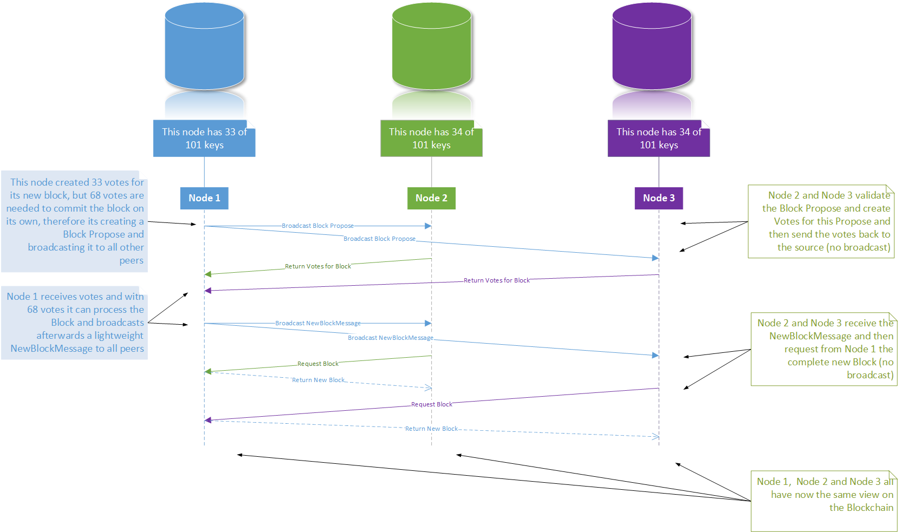

# Package P2P

The P2P package uses the fantastic [js-libp2p](https://github.com/libp2p/js-libp2p) library.

## Bundle

The bundle is the main component of the P2P package. It is responsible to subscribe to certain topics (e.g. a new Block gets proposed) and

In the following picture are other components involved beside P2P. But P2P is the main

