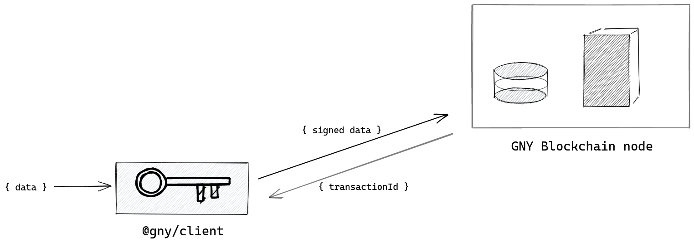

# API

The `@gny/client` acts as a wrapper for all [HTTP endpoints](../http) and **signs transactions**



## Account API

### Open account

```typescript
import { Connection } from "@gny/client";

const connection = new Connection();
const result = await connection.api.Account.openAccount(publicKey);
```

| Name      | Type   | Required | Description           |
| --------- | ------ | -------- | --------------------- |
| publicKey | string | N        | gny account publicKey |

Response Parameter Description:

| Name    | Type | Description                 |
| ------- | ---- | --------------------------- |
| success | bool | Whether login is successful |
| account | json | Account information         |

JSON Response Example:

```js
{
  "account": {
    "address": "G2QEzc5BndQ2h6BsSNqimCWbSBV9L",
    "balance": '20000000000',
    "secondPublicKey": null,
    "lockHeight": '0',
    "lockAmount": '0',
    "isDelegate": 0,
    "username": null,
    "publicKey": "a87c7230d9ade987dbf612605aab652667e6303d2a1c6b2ec91a13733593bb75"
  },
  "latestBlock": {
    "height": 53,
    "timestamp": 3471490
  },
  "version": {
    "version": "1.0.0",
    "build": "Sun Feb 02 2020 19:42:18 GMT+0100 (Central European Standard Time)",
    "net": "testnet"
  }
}
```

### Get balance

```typescript
import { Connection } from "@gny/client";

const connection = new Connection();
const result = await connection.api.Account.getBalance(address);
```

Request Parameter Description:

| Name    | Type   | Required | Description      |
| ------- | ------ | -------- | ---------------- |
| address | string | Y        | Client's address |

Response Parameter Description:

| Name     | Type    | Description                                  |
| -------- | ------- | -------------------------------------------- |
| success  | bool    | Whether request is successful                |
| count    | integer | the number of balances owned by this address |
| balances | Array   | balance list of GNY                          |

JSON Response Example:

```js
{
  "count": 1,
  "balances":  [
  {
    "gny": "400000000000"
  }
  ]
}
```

### Get balance by address and currency

```typescript
import { Connection } from "@gny/client";

const connection = new Connection();
const result = await connection.api.Account.getAddressCurrencyBalance(
  address,
  currency
);
```

Request Parameter Description:

| Name     | Type   | Required | Description      |
| -------- | ------ | -------- | ---------------- |
| address  | string | Y        | Client's address |
| currency | string | Y        | currency         |

Response Parameter Description:

| Name    | Type   | Description                             |
| ------- | ------ | --------------------------------------- |
| success | bool   | true: response data return successfully |
| balance | string | balance                                 |

JSON Response Example:

```json
{
  "success": true,
  "balance": "0"
}
```

### Get the account by address

```typescript
import { Connection } from "@gny/client";

const connection = new Connection();
const result = await connection.api.Account.getAccountByAddress(address);
```

Request Parameter Description:

| Name    | Type   | Required | Description      |
| ------- | ------ | -------- | ---------------- |
| address | string | Y        | Client's address |

Response Parameter Description:

| Name        | Type | Description                           |
| ----------- | ---- | ------------------------------------- |
| success     | bool | whether response data can be returned |
| account     | json | account information                   |
| latestBlock | json | latest block information              |
| version     | json | version information                   |

### Get account by username

```typescript
import { Connection } from "@gny/client";

const connection = new Connection();
const result = await connection.api.Account.getAccountByUsername(username);
```

Request Parameter Description:

| Name     | Type   | Required | Description     |
| -------- | ------ | -------- | --------------- |
| username | string | Y        | Client username |

Response Parameter Description:

| Name        | Type | Description                           |
| ----------- | ---- | ------------------------------------- |
| success     | bool | whether response data can be returned |
| account     | json | account information                   |
| latestBlock | json | latest block information              |
| version     | json | version information                   |

### Get voted delegates

```typescript
import { Connection } from "@gny/client";

const connection = new Connection();
const result = await connection.api.Account.getVotedDelegates(
  address,
  username
);
```

Request Parameter Description:

| Name     | Type   | Required | Description      |
| -------- | ------ | -------- | ---------------- |
| address  | string | Y        | Client's address |
| username | string | Y        | Client username  |

Response Parameter Description:

| Name      | Type  | Description                                                                  |
| --------- | ----- | ---------------------------------------------------------------------------- |
| success   | bool  | true: response data return successfully                                      |
| delegates | Array | A list of (currently forging) delegates for which this account has voted for |

JSON Response Example:

```js
{
	"success": true,
	"delegates": [{
		"username": "wgl_002",
		"address": "GJX8DYKb7mF3M6JCUhBqYnLiha6y",
		"publicKey": "ae256559d06409435c04bd62628b3e7ea3894c43298556f52b1cfb01fb3e3dc7",
		"vote": 9901985415600500,
		"producedblocks": 1373,
		"missedblocks": 6,
		"rate": 1,
		"approval": "98.54",
		"productivity": "99.56"
	},
	{
		"username": "wgl_003",
		"address": "G318FKKb7mF3M6JCUhBqYnLiha6y",
		"publicKey": "c292db6ea14d518bc29e37cb227ff260be21e2e164ca575028835a1f499e4fe2",
		"vote": 9891995435600500,
		"producedblocks": 1371,
		"missedblocks": 8,
		"rate": 2,
		"approval": "98.44",
		"productivity": "99.41"
	},
	{
		"username": "wgl_001",
		"address": "1869971419039689816",
		"publicKey": "c547df2dde6cbb4508aabcb5970d8f9132e5a1d1c422632da6bc20bf1df165b8",
		"vote": 32401577128413,
		"producedblocks": 969,
		"missedblocks": 8,
		"rate": 102,
		"approval": "0.32",
		"productivity": 0
	}]
}
```

### Count the number of accounts

```typescript
import { Connection } from "@gny/client";

const connection = new Connection();
const result = await connection.api.Account.countAccounts();
```

Request Parameter Description: none  
Response Parameter Description:

| Name    | Type   | Description                             |
| ------- | ------ | --------------------------------------- |
| success | bool   | true: response data return successfully |
| count   | number | the total number of accounts            |

### Get publicKey

```typescript
import { Connection } from "@gny/client";

const connection = new Connection();
const result = await connection.api.Account.getPublicKey(address);
```

Request Parameter Description:

| Name    | Type   | Required | Description                        |
| ------- | ------ | -------- | ---------------------------------- |
| address | string | Y        | Client's address, minimum length:1 |

Response Parameter Description:

| Name      | Type   | Description                             |
| --------- | ------ | --------------------------------------- |
| success   | bool   | true: response data return successfully |
| publicKey | string | public key                              |

## Block API

### Get block by id

```typescript
import { Connection } from "@gny/client";

const connection = new Connection();
const result = await connection.api.Block.getBlockById(id);
```

Request Parameter Description:

| Name | Type   | Required | Description |
| ---- | ------ | -------- | ----------- |
| id   | string | Y        | block id    |

Response Parameter Description:

| Name    | Type | Description                             |
| ------- | ---- | --------------------------------------- |
| success | bool | true: response data return successfully |
| block   | json | the block detail information            |

JSON Response Example:

```js
{
  "block":{
    "version":0,
    "payloadHash":"3d2215b8d226b5a38ace219d0ab3f4d84830fd54a832dc05540e20ef81a00547",
    "timestamp":0,
    "delegate":"61ca23509390845f06ccaa43384e889074dfd0c821e4ba3894f8e62b6a31895a",
    "height":"0",
    "count":203,
    "fees":"0",
    "reward":"0",
    "signature":"d49b0d08b164c8df402dc1f24430d51126a05a9d1c4012fbdf89272ab95740454b11fd4b44dbf7c60d4757760d8015146433ae21e2e418fd0d7b3aa03adc5503",
    "id":"fed53e3ad0a1405f73122708ee53dfed2e9eccc34693d52043bdb6aec4751a8c"
  }
}
```

### Get block by height

```typescript
import { Connection } from "@gny/client";

const connection = new Connection();
const result = await connection.api.Block.getBlockByHeight(height);
```

Request Parameter Description:

| Name   | Type   | Required | Description  |
| ------ | ------ | -------- | ------------ |
| height | string | Y        | block height |

Response Parameter Description:

| Name    | Type | Description                             |
| ------- | ---- | --------------------------------------- |
| success | bool | true: response data return successfully |
| block   | json | the block detail information            |

### Get blocks

```typescript
import { Connection } from "@gny/client";

const connection = new Connection();
const result = await connection.api.Block.getBlocks(
  offset,
  limit,
  orderBy,
  transactions
);
```

Request Parameter Description:

| Name         | Type    | Required | Description                                                                                                                                              |
| ------------ | ------- | -------- | -------------------------------------------------------------------------------------------------------------------------------------------------------- |
| limit        | integer | N        | maximum number of returned records, between 0 and 100                                                                                                    |
| offset       | integer | N        | default is 0                                                                                                                                             |
| orderBy      | string  | N        | sort by a field in the table, for example, specify `height:desc` to sort descending, default is `height:asc`. You can only sort by the `height` property |
| transactions | boolean | N        | When transactions=true then                                                                                                                              |

Response Parameter Description:

| Name    | Type    | Description                                    |
| ------- | ------- | ---------------------------------------------- |
| success | bool    | true: response data return successfully        |
| blocks  | Array   | a list of JSON objects containing block detail |
| count   | integer | block height                                   |

JSON Response Example:

```js
{"count":56,
"blocks":[
  {
    "version":0,
    "delegate":"ee9191dff690c0a5b74bba5ab4bddeff60042154d66f2d5c7111123ae8cb4396",
    "height":"55",
    "prevBlockId":"f8d9d54ab0fbbeec1063472a9296e24e8336866de3b0ad5d514fd92ddc73b539",
    "timestamp":3621850,
    "count":0,
    "fees":"0",
    "payloadHash":"e3b0c44298fc1c149afbf4c8996fb92427ae41e4649b934ca495991b7852b855",
    "reward":"0",
    "signature":"81b0090adc75346c8985ebe2c6341ba36eeb4b48a2a66ec69b701d55e35577f0dbdd5a633627098a7a64cb81dd1a9d6fbf13f7c0983fd162f46ef12c5468840f",
    "id":"e70c0b569ca877d262dadcd1967a02427a9996d8c189ee32b7c8bcff7fa3cff2"
  },
  {
    "version":0,
    "delegate":"adc2fdf3174278b2d88f9a37d795fb720ab7530f72367e0aae863143b4b90259",
    "height":"54",
    "prevBlockId":"c3e75c7862a7cbe7f1933837704700bd158c2bd9fc6d1228327323003a0cdd15",
    "timestamp":3620770,
    "count":0,
    "fees":"0",
    "payloadHash":"e3b0c44298fc1c149afbf4c8996fb92427ae41e4649b934ca495991b7852b855",
    "reward":"0",
    "signature":"a17bf15385b65dd84e94a7be6ccd635dc291f63b8128dd4951f7544fafa0632fc281e70dd597ae2770b228bdb581fd182f98fda7dc4a2d82cf8e94ff344ef604",
    "id":"f8d9d54ab0fbbeec1063472a9296e24e8336866de3b0ad5d514fd92ddc73b539"
  }
]}
```

### Get block height

```typescript
import { Connection } from "@gny/client";

const connection = new Connection();
const result = await connection.api.Block.getHeight();
```

Request Parameter Description: none

Response Parameter Description:

| Name    | Type   | Description                             |
| ------- | ------ | --------------------------------------- |
| success | bool   | true: response data return successfully |
| height  | string | block height                            |

JSON Response Example:

```js
{
  "success":true,
  "height": "140569"
}
```

### Get milestone

```typescript
import { Connection } from "@gny/client";

const connection = new Connection();
const result = await connection.api.Block.getMilestone();
```

Request Parameter Description: none  
Response Parameter Description:

| Name      | Type    | Description                             |
| --------- | ------- | --------------------------------------- |
| success   | bool    | true: response data return successfully |
| milestone | integer |                                         |

JSON Response Example:

```js
{
  "success":true,
  "milestone":0
}
```

### Get reward information of a block

```typescript
import { Connection } from "@gny/client";

const connection = new Connection();
const result = await connection.api.Block.getReward();
```

Request Parameter Description: none

Response Parameter Description:

| Name    | Type    | Description                             |
| ------- | ------- | --------------------------------------- |
| success | bool    | true: response data return successfully |
| reward  | integer | the reward of the block                 |

JSON Response Example:

```js
{
  "success":true,
  "reward":200000000
}
```

### Get current maximum supply of the blockchain

```typescript
import { Connection } from "@gny/client";

const connection = new Connection();
const result = await connection.api.Block.getSupply();
```

Request Parameter Description: none

Response Parameter Description:

| Name    | Type    | Description                                  |
| ------- | ------- | -------------------------------------------- |
| success | bool    | true: response data return successfully      |
| supply  | integer | the total amount of XAS in the whole network |

JSON Response Example:

```js
{
  "supply":"10000000000000000"
}
```

### Get current status of blockchain

```typescript
import { Connection } from "@gny/client";

const connection = new Connection();
const result = await connection.api.Block.getStatus();
```

Request Parameter Description: none

Response Parameter Description:

| Name      | Type      | Description                              |
| --------- | --------- | ---------------------------------------- |
| success   | bool      | true: response data return successfully  |
| height    | string    | blockchain height                        |
| fee       | string    | transaction fee                          |
| milestone | integer   |                                          |
| reward    | integer   | block reward                             |
| supply    | BigNumber | total amount of XAS in the whole network |

JSON Response Example:

```js
{
  "height":"11",
  "fee":"10000000",
  "milestone":0,
  "reward":0,
  "supply":"10000000000000000"
}
```

## Delegate

### Count the number of delegates

```typescript
import { Connection } from "@gny/client";

const connection = new Connection();
const result = await connection.api.Delegate.count();
```

Request Parameter Description: none

Response Parameter Description:

| Name    | Type    | Description                             |
| ------- | ------- | --------------------------------------- |
| success | bool    | true: response data return successfully |
| count   | integer | total number of delegates               |

JSON Response Example:

```js
{
    "success":true,
    "count":234
}
```

### Get the Voters for a Delegate

```typescript
import { Connection } from "@gny/client";

const connection = new Connection();

// get accounts that voted for delegate leo
const delegate = "leo";
const result = await connection.api.Delegate.getVoters(delegate);
```

Request Parameter Description:

| Name     | Type   | Required | Description              |
| -------- | ------ | -------- | ------------------------ |
| username | string | Y        | username of the delegate |

Response Parameter Description:

| Name                 | Type   | Description                                                                                                                                                                                                                   |
| -------------------- | ------ | ----------------------------------------------------------------------------------------------------------------------------------------------------------------------------------------------------------------------------- |
| success              | bool   | true: response data return successfully                                                                                                                                                                                       |
| accounts             | Array  | an array of accounts that voted for this delegate. In order to vote one doesn't need to be delegate. It is enough to have some GNY tokens locked. Only the locked GNY tokens add to the weight of the delegate in the ranking |
| accounts[0].delegate | Object | The `delegate` object on an account object is entirely optional. The `delegate` object appears only if the the account that voted is also a `delegate`.                                                                       |

JSON Response Example:

```js
{
  "success": true,
  "accounts": [
    {
      "address": "G3uxh6H3iB4mmtPYnzvpT9itQHCzz",
      "username": null,
      "gny": "19980000000",
      "publicKey": null,
      "secondPublicKey": null,
      "isDelegate": 0,
      "isLocked": 1,
      "lockHeight": "2500000",
      "lockAmount": "20000000000",
      "_version_": 5,
      "balance": "19980000000",
      "weightRatio": "0.00004964719289781813"
    },
    {
      "address": "GAeE4cWpKxs33gMrbJ7B5TXKBBQE",
      "username": "www",
      "gny": "19450000000",
      "publicKey": null,
      "secondPublicKey": null,
      "isDelegate": 0,
      "isLocked": 1,
      "lockHeight": "2600000",
      "lockAmount": "40000000000",
      "_version_": 11,
      "balance": "19450000000",
      "weightRatio": "0.00009929438579563626"
    },
    {
      "address": "GXDgJFW9nnSKYomtZirW8SqDDnqW",
      "username": "tonyt_gny",
      "gny": "2988814356531",
      "publicKey": null,
      "secondPublicKey": null,
      "isDelegate": 1,
      "isLocked": 1,
      "lockHeight": "173400",
      "lockAmount": "89000000000",
      "_version_": 13687,
      "balance": "2988814356531",
      "weightRatio": "0.00022093000839529067",
      "delegate": {
        "address": "GXDgJFW9nnSKYomtZirW8SqDDnqW",
        "tid": "3332ffe9344877de18ede0294fee8b350d36992e89e61d1672e813a894e323db",
        "username": "tonyt_gny",
        "publicKey": "e6408dcb79ac12cb2e61d77b869a146081f554e73501608a686a809043de0b88",
        "votes": "557100000000",
        "producedBlocks": "25341",
        "missedBlocks": "812",
        "fees": "2334356531",
        "rewards": "2986000000000",
        "_version_": 24342,
        "rate": 1,
        "approval": "0.001382922558168724",
        "productivity": "0.96895193668030436279"
      }
    }
  ]
}
```

### Get own votes with username or address

Get votes with username:

```typescript
import { Connection } from "@gny/client";

const params = { username: "a1300" };

const connection = new Connection();
const result = await connection.api.Delegate.getOwnVotes(params);
```

Get votes with address:

```typescript
import { Connection } from "@gny/client";

const params = { address: "GtnevSTQqPUcZNAMFJmc8DLUXHFz" };

const connection = new Connection();
const result = await connection.api.Delegate.getOwnVotes(params);
```

Request Parameter Description:

| Name     | Type   | Required | Description             |
| -------- | ------ | -------- | ----------------------- |
| username | string | N        | username of the account |
| address  | string | N        | address of the account  |

Response Parameter Description:

| Name      | Type  | Description                             |
| --------- | ----- | --------------------------------------- |
| success   | bool  | true: response data return successfully |
| delegates | Array | a JSON object list of account           |

JSON Response Example:

```js
{
   "success":true,
   "delegates":[
      {
         "address":"G3yguB3tazFf6bia3CU1RjXtv2iV6",
         "username":"gny_d72",
         "tid":"ce6fced7d207e7e55f92a3b68a2394f34b2404cba5c35ea31bf80d2bc871efd5",
         "publicKey":"feda901bb63e494e2f30865734e40aa0464f59f2a526a61648c86ba2faf1a952",
         "votes":"900000000000",
         "producedBlocks":"0",
         "missedBlocks":"0",
         "fees":"0",
         "rewards":"0",
         "_version_":2,
         "rate":1,
         "approval":"0.00225",
         "productivity":"100.00"
      },
      {
         "address":"GtZDocCVQ6iNR6JzjPCqgJPzmoRN",
         "username":"gny_d58",
         "tid":"aeb8ae1404985bb38c18d695ce9c336b65382c94fa85d38db3d575f03d3ff84f",
         "publicKey":"fbc95173f63a02239ff37f81236e283504d247d551143d16c2fee80c692b25bd",
         "votes":"900000000000",
         "producedBlocks":"1",
         "missedBlocks":"0",
         "fees":"0",
         "rewards":"0",
         "_version_":3,
         "rate":2,
         "approval":"0.00225",
         "productivity":"100.00"
      }
   ]
}
```

### Get delegate by public key

```typescript
import { Connection } from "@gny/client";

const connection = new Connection();
const result = await connection.api.Delegate.getDelegateByPubKey(publicKey);
```

Request Parameter Description:

| Name      | Type   | Required | Description           |
| --------- | ------ | -------- | --------------------- |
| publickey | string | Y        | delegate's public key |

Response Parameter Description:

| Name     | Type | Description                             |
| -------- | ---- | --------------------------------------- |
| success  | bool | true: response data return successfully |
| delegate | JSON | the detail information of this delegate |

JSON Response Example:

```js
{
  "delegate":{
    "address":"G3kkkSaJNVY87AhVPyxXVGFpR61VB",
    "username":"gny_d1",
    "transactionId":"156c950d69dda92214fa26d37baff860990fad43d40ba74a342fabf9adaaa2dc",
    "publicKey":"85b4c2efe56642398dad3f1ec338e87e712063cfaee4a836cb58b673cdb820f4",
    "votes":"0",
    "producedBlocks":"0",
    "missedBlocks":"0",
    "fees":"0",
    "rewards":"0",
    "_version_":1,
    "rate":47,
    "approval":"0",
    "productivity":"0.00",
    "vote":0,
  }
}
```

### Get delegate by user name

```typescript
import { Connection } from "@gny/client";

const connection = new Connection();
const result = await connection.api.Delegate.getDelegateByUsername(username);
```

Request Parameter Description:

| Name     | Type   | Required | Description          |
| -------- | ------ | -------- | -------------------- |
| username | string | Y        | delegate's user name |

Response Parameter Description:

| Name     | Type | Description                             |
| -------- | ---- | --------------------------------------- |
| success  | bool | true: response data return successfully |
| delegate | JSON | the detail information of this delegate |

### Get delegate by address

```typescript
import { Connection } from "@gny/client";

const connection = new Connection();
const result = await connection.api.Delegate.getDelegateByAddress(address);
```

Request Parameter Description:

| Name    | Type   | Required | Description        |
| ------- | ------ | -------- | ------------------ |
| address | string | Y        | delegate's address |

Response Parameter Description:

| Name     | Type | Description                             |
| -------- | ---- | --------------------------------------- |
| success  | bool | true: response data return successfully |
| delegate | JSON | the detail information of this delegate |

### Get the list of Delegates

```typescript
import { Connection } from "@gny/client";

const connection = new Connection();
const result = await connection.api.Delegate.getDelegates(offset, limit);
```

Request Parameter Description:

| Name   | Type    | Required | Description            |
| ------ | ------- | -------- | ---------------------- |
| offset | int     | N        | maximum return records |
| limit  | integer | N        | offset, minimum: 0     |

Response Parameter Description:

| Name       | Type   | Description                                     |
| ---------- | ------ | ----------------------------------------------- |
| success    | bool   | true: response data return successfully         |
| delegates  | Array  | a list containing delegates' detail information |
| totalCount | number | How many delegates exist overall?               |

JSON Response Example:

```js
{
  "totalCount":101,
  "delegates":[{
    "address":"G3kkkSaJNVY87AhVPyxXVGFpR61VB",
    "username":"gny_d1",
    "transactionId":"156c950d69dda92214fa26d37baff860990fad43d40ba74a342fabf9adaaa2dc",
    "publicKey":"85b4c2efe56642398dad3f1ec338e87e712063cfaee4a836cb58b673cdb820f4",
    "votes":"0",
    "producedBlocks":"0",
    "missedBlocks":"0",
    "fees":"0",
    "rewards":"0",
    "_version_":1,
    "rate":47,
    "approval":"0",
    "productivity":"0.00",
    "vote":0,
  },
  {
    "address":"G94UbHjRnd6Em1o3FxQAqkMXA2RV",
    "username":"gny_d10",
    "transactionId":"9f9a6818b467dcc73c71c24ff622babeb63850263626dfc7472c1f87f58ebbe9",
    "publicKey":"ff47c9e9bafcf28ae8528c2b259661ade96a3030ab73ddde82b52ee44c9122b5",
    "votes":"0",
    "producedBlocks":"0",
    "missedBlocks":"0",
    "fees":"0",
    "rewards":"0",
    "_version_":1,
    "rate":2,
    "approval":0,
    "productivity":"0.00",
    "vote":0,
  }
]}
```

### Enable forging

```typescript
import { Connection } from "@gny/client";

const connection = new Connection();
const result = await connection.api.Delegate.forgingEnable(secret, pulicKey);
```

Request Parameter Description:

| Name      | Type   | Required | Description           |
| --------- | ------ | -------- | --------------------- |
| secret    | string | Y        | gny account password  |
| publickey | string | Y        | delegate's public key |

Response Parameter Description:

| Name    | Type | Description                             |
| ------- | ---- | --------------------------------------- |
| success | bool | true: response data return successfully |

### Disable forging

```typescript
import { Connection } from "@gny/client";

const connection = new Connection();
const result = await connection.api.Delegate.forgingDisable(secret, pulicKey);
```

Request Parameter Description:

| Name      | Type   | Required | Description           |
| --------- | ------ | -------- | --------------------- |
| secret    | string | Y        | gny account password  |
| publickey | string | Y        | delegate's public key |

Response Parameter Description:

| Name    | Type | Description                             |
| ------- | ---- | --------------------------------------- |
| success | bool | true: response data return successfully |

### Get forging status

```typescript
import { Connection } from "@gny/client";

const connection = new Connection();
const result = await connection.api.Delegate.forgingStatus(pulicKey);
```

Request Parameter Description:

| Name      | Type   | Required | Description           |
| --------- | ------ | -------- | --------------------- |
| publickey | string | Y        | delegate's public key |

Response Parameter Description:

| Name    | Type | Description                             |
| ------- | ---- | --------------------------------------- |
| success | bool | true: response data return successfully |
| enabled | bool | true: forging is enabled                |

### Search delegates by pattern

Search by pattern:

```typescript
import { Connection } from "@gny/client";

const pattern = "joe";
const offset = 200;
const limit = 0;

const connection = new Connection();
const result = await connection.api.Delegate.search(pattern, offset, limit);
```

Or by address:

```typescript
import { Connection } from "@gny/client";

const pattern = "GvgEVFdRQqr9x2MAEuRRik26b78e";

const connection = new Connection();
const result = await connection.api.Delegate.search(pattern);
```

Request Parameter Description:

| Name      | Type    | Required | Description                                                                                                                                                                                                               |
| --------- | ------- | -------- | ------------------------------------------------------------------------------------------------------------------------------------------------------------------------------------------------------------------------- |
| searchFor | string  | Y        | if provided with a full `address`, only this delegate gets returned. If provided with a part of a delegate (e.g. `jo`) all matching delegates that include this pattern get returned. This endpoint is **case sensitive** |
| limit     | integer | N        | limit, default 200                                                                                                                                                                                                        |
| offset    | integer | N        | offset, default 0                                                                                                                                                                                                         |

Response Parameter Description:

| Name     | Type   | Description                                                                                                                                                                                                                                   |
| -------- | ------ | --------------------------------------------------------------------------------------------------------------------------------------------------------------------------------------------------------------------------------------------- |
| success  | bool   | true: response data return successfully                                                                                                                                                                                                       |
| delegate | Array  | the detail information of the matching delegates                                                                                                                                                                                              |
| count    | number | count how many delegates match the `searchFor` pattern overall. By default only 200 delegates get returned that match the `searchFor` pattern, therefore you need to have page thourgh the rest with the help of the `offset` query parameter |

JSON Response Example:

```js
{
  "success": true,
  "count": 2,
  "delegates": [
    {
      "address": "G446P6BKURurRxJHD2UUEG4o4VA3B",
      "username": "joe",
      "tid": "8588f5deaf615e5c850b975d73b3d3686e0300640112b88edb21f02c53428597",
      "publicKey": "f1e2b42cfdd374c80d0d6ad5b826f3fc6b5fc9fb5ede58414a64478c965e12dd",
      "votes": "0",
      "producedBlocks": "0",
      "missedBlocks": "0",
      "fees": "0",
      "rewards": "0",
      "_version_": 1,
      "rate": 3,
      "approval": "0",
      "productivity": "0"
    },
    {
      "address": "G3CNAxZjNPh6eB9yfunwP6LSXu2uN",
      "username": "first_joel_r",
      "tid": "ef1252e509e9c8a5fdddf187f7e85d37323f0be31fb78b3bc3848f22d4021a2b",
      "publicKey": "df4223caa6f544075a3791429532f1129d22da11f4b514053fa8a336a2b8980a",
      "votes": "0",
      "producedBlocks": "0",
      "missedBlocks": "0",
      "fees": "0",
      "rewards": "0",
      "_version_": 1,
      "rate": 10,
      "approval": "0",
      "productivity": "0"
    }
  ]
}
```

## Loader

### Get blockchain status

```typescript
import { Connection } from "@gny/client";

const connection = new Connection();
const result = await connection.api.Loader.getStatus();
```

Request Parameter Description: none

Response Parameter Description:

| Name    | Type | Description                                 |
| ------- | ---- | ------------------------------------------- |
| success | bool | true: response data return successfully     |
| loaded  | bool | true: the blockchain is loaded successfully |

### Sync blockchain status

```typescript
import { Connection } from "@gny/client";

const connection = new Connection();
const result = await connection.api.Loader.getStatus();
```

Request Parameter Description: none

Response Parameter Description:

| Name    | Type   | Description                             |
| ------- | ------ | --------------------------------------- |
| success | bool   | true: response data return successfully |
| syncing | bool   | true: the blockchain is syncing         |
| blocks  | number | the number of blocks to be synced       |
| height  | string | the height of last block                |

## Peer

### Get peers

```typescript
import { Connection } from "@gny/client";

const connection = new Connection();
const result = await connection.api.Peer.getPeers();
```

Request Parameter Description: none

Response Parameter Description:

| Name    | Type  | Description                             |
| ------- | ----- | --------------------------------------- |
| success | bool  | true: response data return successfully |
| peers   | Array | A list of peer information              |
| count   | bool  | The number of peers                     |

JSON Response Example:

```js
{
  "success": true,
  "peers": [
    {
      "id": {
        "id": "QmeDn2SETzxuENnAiynzWXjw78eDRiNLmwzNDtwb2XhVsi",
        "pubKey": "CAASpgIwggEiMA0GCSqGSIb3DQEBAQUAA4IBDwAwggEKAoIBAQDo9QnqRUmrO3uAqyoAAnjmDB7+lCSA9a7tAKv0vsq0fnq0/espA70e7sJZSjmHqOpP5Jyse3pjezMfSsBR80vQJheb0dOwCsZu/dJ2kA0nuXRZwOd7ZUUsRUh5oj5NFBrY3tuScq/HtbXDqMs0MZdlKIBkEseTnF1rLZw8fhIiY3AFwlJFUCNGKyrk2rk6IvrwMWshyBkr+r1pPfGp6W46/fw5gwdvRTgxCvmqkQq35uncosBbV2+lAimvviTfT7NR6SuLdkAb5TqC0kh7XJV2eu44TtHwI/rTQw0lfCg/WnRKA+uFyedeg3BcTzqjdnhkxP8v7KAMnxi8Z/3q50jbAgMBAAE="
      },
      "multiaddrs": [
        "/ip4/13.80.136.143/tcp/4097/p2p/QmeDn2SETzxuENnAiynzWXjw78eDRiNLmwzNDtwb2XhVsi"
      ],
      "simple": {
        "host": "13.80.136.143",
        "port": 4097
      }
    },
    {
      "id": {
        "id": "QmPiFnYYNeuYBxqzA77bPPrpJ8AaGJQujMVFXYJEGbpMRR",
        "pubKey": "CAASpgIwggEiMA0GCSqGSIb3DQEBAQUAA4IBDwAwggEKAoIBAQDghE7wWvJxLW2KFTgfaBQ6Yh5hpSrxZqlOu/M4kWFcZ87S81053So92CCcTLdJPaE6mvip3/PTHpzzvfsiEhk7/1oTHDonKjbx44L39dqzvVht+q8LyU3XYo8qw6mJd4Ry69+89V1RmgJGdEtR+G2sBQxZ/m+subcHKfy6jvG2Zw8BkJdcyjlAXaH4mw9ZO5lkrN8E0aI32GwipVBu37Wts7ZYIcJxZ9zxGGVwNb7B8Utq2DVSpmqguM9M1DsBDJZ+yZg3vF435zLcmMS7eRLCB0PIXrZ5HPYsDKk/FMyF3sDy05xtGTUgF75L7zeMYxoEUg6BtgM9HV5T2cWtcDDXAgMBAAE="
      },
      "multiaddrs": [
        "/ip4/174.129.53.40/tcp/4097/p2p/QmPiFnYYNeuYBxqzA77bPPrpJ8AaGJQujMVFXYJEGbpMRR"
      ],
      "simple": {
        "host": "174.129.53.40",
        "port": 4097
      }
    }
  ],
  "count": 2
}
```

### Get version

```typescript
import { Connection } from "@gny/client";

const connection = new Connection();
const result = await connection.api.Peer.getVersion();
```

Request Parameter Description: none

Response Parameter Description:

| Name    | Type   | Description                             |
| ------- | ------ | --------------------------------------- |
| success | bool   | true: response data return successfully |
| version | string | Version of blockchain                   |
| build   | string | Build version                           |
| net     | string | Net version                             |

JSON Response Example:

```js
{
  "success": true,
  "version": "1.0.5",
  "build": "Tue Jan 28 2020 12:44:42 GMT+0000 (Coordinated Universal Time)",
  "net": "localnet"
}
```

### Get info

```typescript
import { Connection } from "@gny/client";

const connection = new Connection();
const result = await connection.api.Peer.getInfo();
```

Request Parameter Description: none

Response Parameter Description:

| Name       | Type             | Description                                                                                               |
| ---------- | ---------------- | --------------------------------------------------------------------------------------------------------- |
| success    | bool             | true: response data return successfully                                                                   |
| id         | string of peerId | libp2p [peer-id](https://www.npmjs.com/package/peer-id)                                                   |
| multiaddrs | string[]         | Array of [multiaddrs](https://www.npmjs.com/package/multiaddr) strings which is used for p2p communcation |
| publicIp   | string           | own public ip                                                                                             |
| address    | string           | ip address on which the server is listening. Normal this is a private ip address                          |

JSON Response Example:

```js
{
  "success": true,
  "id": "QmQbVdde9AeXSP3FoLyVNd3Fi3BjCe2tFyJV43bNWEBYSA",
  "multiaddrs": [
    "/ip4/20.188.42.0/tcp/4097/p2p/QmQbVdde9AeXSP3FoLyVNd3Fi3BjCe2tFyJV43bNWEBYSA"
  ],
  "publicIp": "20.188.42.0",
  "address": "10.0.3.4"
}
```

## System

### Get version

```typescript
import { Connection } from "@gny/client";

const connection = new Connection();
const result = await connection.api.System.getSystemInfo();
```

Request Parameter Description: none

Response Parameter Description:

| Name      | Type   | Description                             |
| --------- | ------ | --------------------------------------- |
| success   | bool   | true: response data return successfully |
| os        | string | Operating system information            |
| version   | string | Version of blockchain                   |
| timestamp | string | the time right now                      |
| lastBlock | json   | Basic information about last block      |

## Transaction

### Get transactions

```typescript
import { Connection } from "@gny/client";

const connection = new Connection();
const result = await connection.api.Transaction.getTransactions(query);
```

Request Parameter Description:

| Name                  | Type     | Required              | Description                                                                                         |
| --------------------- | -------- | --------------------- | --------------------------------------------------------------------------------------------------- |
| query.limit           | integer  | N                     | the limitation of returned records，minimum：0,maximum：100                                         |
| query.offset          | integer  | N                     | offset, minimum 0                                                                                   |
| query.id              | string   | N                     | transaction id                                                                                      |
| query.senderId        | N        | GNY address of sender |
| query.senderPublicKey | string   | N                     | sender's public key                                                                                 |
| query.blockId         | string   | N                     | block id                                                                                            |
| query.height          | integer  | specific block height |
| query.type            | interger | N                     | Transaction type, see https://github.com/GNYIO/gny-general/wiki/Transactions for futher information |
| query.message         | string   | Transaction message   |

Response Parameter Description:

| Name         | Type  | Description                                                 |
| ------------ | ----- | ----------------------------------------------------------- |
| success      | bool  | true: response data return successfully                     |
| transactions | Array | A JSON object list containing multiple transactions' detail |
| count        | int   | the total number of retrieved transactions                  |

JSON Response Example:

```js
{
  "transactions":[
    {
      "transactionId":"42254052d4bc1e1132c316469194e6b756a6c0f086a24b00c05a91ced5502046",
      "senderId":"G25AKCRu8mK2b4QXq8Jk8bFiNfxeY",
      "recipientId":"G2MdtJJPCWTFGZ75QoP7Z5KowRhst",
      "recipientName":null,
      "currency":"gny",
      "amount":"10000000000000000",
      "timestamp":0,
      "height":"0",
      "_version_":1
    }
  ],
  "count":1
}
```

### Get unconfirmed transactions by transaction id

```typescript
import { Connection } from "@gny/client";

const connection = new Connection();
const result = await connection.api.Transaction.getUnconfirmedTransaction(id);
```

Request Parameter Description:

| Name | Type   | Required | Description                |
| ---- | ------ | -------- | -------------------------- |
| id   | string | Y        | unconfirmed transaction id |

Response Parameter Description:

| Name        | Type | Description                                |
| ----------- | ---- | ------------------------------------------ |
| success     | bool | true: response data return successfully    |
| transaction | json | unconfirmed transaction detail inforamtion |

JSON Response Example:

```js
{
  "transactionId":"42254052d4bc1e1132c316469194e6b756a6c0f086a24b00c05a91ced5502046",
  "senderId":"G25AKCRu8mK2b4QXq8Jk8bFiNfxeY",
  "recipientId":"G2MdtJJPCWTFGZ75QoP7Z5KowRhst",
  "recipientName":null,
  "currency":"gny",
  "amount":"10000000000000000",
  "timestamp":0,
  "height":"0",
  "_version_":1
}
```

### Get unconfirmed transactions by sender public key or address

```typescript
import { Connection } from "@gny/client";

const connection = new Connection();
const result = await connection.api.Transaction.getUnconfirmedTransaction(
  publicKey,
  address
);
```

Request Parameter Description:

| Name            | Type   | Required | Description         |
| --------------- | ------ | -------- | ------------------- |
| senderPublicKey | string | N        | sender's public key |
| address         | string | N        | address             |

Response Parameter Description:

| Name         | Type  | Description                                    |
| ------------ | ----- | ---------------------------------------------- |
| success      | bool  | true: response data return successfully        |
| transactions | Array | a list containing all unconfirmed transactions |

JSON Response Example:

```js
{
	"success": true,
	"transactions": []      //Currently there is no unconfirmed transaction in the whole network
}
```

### Create a batch of transactions

```typescript
import { Connection } from "@gny/client";

const connection = new Connection();
const genesisSecret =
  "grow pencil ten junk bomb right describe trade rich valid tuna service";
const trs = gnyClient.basic.transfer(
  "GuQr4DM3aiTD36EARqDpbfsEHoNF",
  50 * 1e8,
  undefined,
  genesisSecret,
  undefined
);
const transactions = [trs];
const result = await connection.api.Transaction.addTransactions(transactions);
```

Request Parameter Description:  
| Name | Type | Required | Description |  
| ------------ | ----- | -------- | --------------------- |  
| transactions | Array | Y | Array of transactions |

JSON Response Example:

```js
{
  "success": true,
  "transactions": [
    {
      "type": 0,
      "timestamp": 3619538,
      "fee": 10000000,
      "args": [
        5000000000,
        "GuQr4DM3aiTD36EARqDpbfsEHoNF"
      ],
      "senderPublicKey": "575bf8f32b941b9e6ae1af82539689198327b73d77d22a98cdef2460c9257f7b",
      "senderId": "G4GDW6G78sgQdSdVAQUXdm5xPS13t",
      "signatures": [
        "5fd14364bed18697f9c9ec1e03d66825af2cc9e716d5f6089dc265d99d5d6f3a79b778a48733e06b1353ea007036455ab4b9f0d4a3035a343584c4fb137e1400"
      ],
      "id": "0bd53c3a60b6746e4383dbafa8f63f2eaea7e167e0e754cbf9aaf419b3cb2eef"
    }
  ]
}
```

### Get Transactions count

```typescript
import { Connection } from "@gny/client";
const connection = new Connection();

// no argument (count all transactions)
const countAllTransactions = await connection.api.Transaction.count();

// or (count transactions of a specific user)
const senderPublicKey =
  "1dcd1197d073e1ed3bba872572afda6b02dd926fa1e4454ec796bf4ec0313973";
const countTrsOfPublicKey = await connection.api.Transaction.count({
  senderPublicKey
});

// or (count transactions of a specific user)
const senderId = "G3TCoN8jRQenDPRLKj3wEx4DkXKy4";
const countTrsOfSenderId = await connection.api.Transaction.count({
  senderId
});
```

Request Parameter Description:
| Name | Type | Required | Description |
| ----- | ------ | ------ | ---------------------------------------------------------------- |
| senderId | N | string | Optional `senderId` parameter |
| senderPublicKey | N | string | Optional `senderPublicKey` parameter |

Response Parameter Description:  
| Name | Type | Description |
| ----- | ------ | ---------------------------------------------------------------- |
| count | number | the number of currently confirmed transactions on the Blockchain |

JSON Response Example:

```js
{
  "count": 203
}
```

### Get Transaction (newest first)

```typescript
import { Connection } from "@gny/client";
const connection = new Connection();

// get transactions of all users
// first fetch the count of all transactions
const allUsersCount = await connection.api.Transaction.count();
// now get the transactions
const response0 = await connection.api.Transaction.newestFirst({
  count: allUsersCount.count,
  offset: 0,
  limit: 100
});

// get the transactions of a specific user (by senderId)
// first count the transactions for this user
const senderId = "G3TCoN8jRQenDPRLKj3wEx4DkXKy4";
const userTransactionCount = connection.api.Transaction.count({
  senderId
});
// now get the transactions for this user (by senderId)
const response1 = await connection.api.Transaction.newestFirst({
  count: userTransactionCount.count,
  offset: 0,
  limit: 100,
  senderId
});

// get the transactions of a specific user (by senderPublicKey)
const senderPublicKey =
  "1dcd1197d073e1ed3bba872572afda6b02dd926fa1e4454ec796bf4ec0313973";
const userPublicKeyTransactionCount = await connection.api.Transaction.count({
  senderPublicKey
});
// now get the transactions for this user (by senderPublicKey)
const response1 = await connection.api.Transaction.newestFirst({
  count: userPublicKeyTransactionCount.count,
  offset: 0,
  limit: 100,
  senderPublicKey
});
```

Request Parameter Description:

| Name            | Type   | Required | Description                                                                                                                                                                                                                                                                                                                                                                                                                                                                                                                                                                                                                                                                                                                                                                                                                        |
| --------------- | ------ | -------- | ---------------------------------------------------------------------------------------------------------------------------------------------------------------------------------------------------------------------------------------------------------------------------------------------------------------------------------------------------------------------------------------------------------------------------------------------------------------------------------------------------------------------------------------------------------------------------------------------------------------------------------------------------------------------------------------------------------------------------------------------------------------------------------------------------------------------------------- |
| count           | number | Y        | The `count` paramter is required. New transactions can be added to the Blockchain every second and which transaction are the newest and get returned by this endpoint **changes** when new transactions arrive. If the total transaction count changes between two HTTP requests, then the starting point of the counting would change. This would lead to inconsistent result. This makes this parameter mandatory. Therefore it is advised to first fetch the current count of all transactions (`/api/transactions/count`) and pass it then to this endpoint (`/api/transactions/newestFirst?count=123`). If the `count` parameter is passed in, the returned values are consistent. Then paging can be used with `?count=123&offset=0` and then `?count=123&offset=100` to get the first 100 transactions and then the next 23 |
| limit           | number | N        | maximum number of returned records, between 0 and 100                                                                                                                                                                                                                                                                                                                                                                                                                                                                                                                                                                                                                                                                                                                                                                              |
| offset          | number | N        | default is 0                                                                                                                                                                                                                                                                                                                                                                                                                                                                                                                                                                                                                                                                                                                                                                                                                       |
| senderId        | string | N        | Optional parameter `senderId`. This can be used to filter for the `senderId` of all transactions                                                                                                                                                                                                                                                                                                                                                                                                                                                                                                                                                                                                                                                                                                                                   |
| senderPublicKey | sring  | N        | Optional parameter `senderPublicKey`. This can be used to filter for the `senderPublicKey` of all transactions                                                                                                                                                                                                                                                                                                                                                                                                                                                                                                                                                                                                                                                                                                                     |

Response Parameter Description:

| Name         | Type   | Description                                                      |
| ------------ | ------ | ---------------------------------------------------------------- |
| success      | bool   | true: response data return successfully                          |
| count        | number | the number of currently confirmed transactions on the Blockchain |
| transactions | Array  | a list containing all unconfirmed transactions                   |

First JSON Response Example:

```js
{
	"count": 203
}
```

Second JSON Response Example:

```js
"transactions":[
    {
      "transactionId":"42254052d4bc1e1132c316469194e6b756a6c0f086a24b00c05a91ced5502046",
      "senderId":"G25AKCRu8mK2b4QXq8Jk8bFiNfxeY",
      "recipientId":"G2MdtJJPCWTFGZ75QoP7Z5KowRhst",
      "recipientName":null,
      "currency":"gny",
      "amount":"10000000000000000",
      "timestamp":0,
      "height":0,
      "_version_":1
    },
    // ...
  ],
  "count":203
```

## Transfer

### Get transfers

```typescript
import { Connection } from "@gny/client";

const connection = new Connection();
const result = await connection.api.Transfer.getRoot(query);
```

Request Parameter Description:

| Name              | Type    | Required | Description                                                 |
| ----------------- | ------- | -------- | ----------------------------------------------------------- |
| query.limit       | integer | N        | the limitation of returned records，minimum：0,maximum：100 |
| query.offset      | integer | N        | offset, minimum 0                                           |
| query.ownId       | string  | N        | public key related to transfers                             |
| query.currency    | string  | N        | gny UIA Assets                                              |
| query.senderId    | string  | N        | GNY address of sender                                       |
| query.recipientId | string  | N        | recipient's public key                                      |

Response Parameter Description:

| Name      | Type   | Description                             |
| --------- | ------ | --------------------------------------- |
| success   | bool   | true: response data return successfully |
| count     | string | the number of transfers                 |
| transfers | Array  | An array of transfers                   |

### Get total amount of transfers

```typescript
import { Connection } from "@gny/client";

const connection = new Connection();
const result = await connection.api.Transfer.getAmount(
  startTimestamp,
  endTimestamp
);
```

Request Parameter Description:

| Name           | Type   | Required | Description     |
| -------------- | ------ | -------- | --------------- |
| startTimestamp | string | Y        | start timestamp |
| endTimestamp   | string | Y        | end timestamp   |

Response Parameter Description:

| Name           | Type   | Description                             |
| -------------- | ------ | --------------------------------------- |
| success        | bool   | true: response data return successfully |
| count          | string | the number of transfers                 |
| strTotalAmount | string | the total amout of transfers            |

## Transport

### Send unconfirmed transaction

```typescript
import { Connection } from "@gny/client";

const connection = new Connection();
const result = await connection.api.Transport.sendTransaction(transaction);
```

Request Parameter Description:

| Name        | Type | Required | Description            |
| ----------- | ---- | -------- | ---------------------- |
| transaction | json | Y        | Unconfirmed transction |

Response Parameter Description:

| Name          | Type   | Description                             |
| ------------- | ------ | --------------------------------------- |
| success       | bool   | true: response data return successfully |
| transactionId | string | transaction id                          |

## User Defined Asset UIA

### Get all publishers

```typescript
import { Connection } from "@gny/client";

const connection = new Connection();
const result = await connection.api.Uia.getIssuers(limit, offset);
```

Request Parameter Description:

| Name   | Type    | Required | Description                                            |
| ------ | ------- | -------- | ------------------------------------------------------ |
| limit  | integer | N        | maximum number of records to return, between 0 and 100 |
| offset | integer | N        | Offset, minimum 0                                      |

Response Parameter Description:

| Name    | Type    | Description                             |
| ------- | ------- | --------------------------------------- |
| success | boolean | true: response data return successfully |
| issues  | Array   | Array of publishers                     |
| count   | integer | Total number of publishers              |

JSON Response:

```js
{
  "count":1,
  "issues":[{
      "tid":"279ee5d155f25bd5eb7f09b63a6e096b89e22ff70b5b8a9858cfd19dc21149d3",
      "name":"AAA",
      "issuerId":"G4GDW6G78sgQdSdVAQUXdm5xPS13t",
      "desc":"\"some description\"",
      "_version_":1
  }]
}
```

### Check if the address is a publisher

```typescript
import { Connection } from "@gny/client";

const connection = new Connection();
const result = await connection.api.Uia.isIssuer(address);
```

Request Parameter Description:

| Name    | Type   | Required | Description                    |
| ------- | ------ | -------- | ------------------------------ |
| address | string | Y        | Can be the GNY account address |

Response Parameter Description:

| Name       | Type    | Description                             |
| ---------- | ------- | --------------------------------------- |
| success    | boolean | true: response data return successfully |
| isIssuer   | boolean | true: the address is an issuer          |
| issuerName | string  | the publisher name                      |

JSON Response:

```js
{
  "success": true,
  "isIssuer": true,
  "issuerName": "AAA"
}
```

### Query information about a publisher

```typescript
import { Connection } from "@gny/client";

const connection = new Connection();
const result = await connection.api.Uia.getIssuer(publisherName | address);
```

Request Parameter Description:

| Name          | Type   | Required | Description                    |
| ------------- | ------ | -------- | ------------------------------ |
| publisherName | string | Y        | Can be GNY publisher name      |
| address       | string | Y        | Can be the GNY account address |

Response Parameter Description:

| Name    | Type    | Description                                                   |
| ------- | ------- | ------------------------------------------------------------- |
| success | boolean | Whether operation was successful                              |
| issuer  | JSON    | Contains the publisher name, description and id (GNY address) |

JSON Response:

```js
{
  "issuer":{
    "tid":"c194bf2d4ccb1d07829f161165b307332d91a14f44a71a7a99a28dea8154e524",
    "name":"AAA",
    "issuerId":"G4GDW6G78sgQdSdVAQUXdm5xPS13t",
    "desc":"\"some description\"",
    "_version_":1
  }
}
```

### View assets of a specified publisher

```typescript
import { Connection } from "@gny/client";

const connection = new Connection();
const name = 'MARCUS';
const result = await connection.api.Uia.getIssuerAssets(name, limit?, offset?);
```

Request Parameter Description:

| Name   | Type    | Required | Description                                            |
| ------ | ------- | -------- | ------------------------------------------------------ |
| name   | string  | Y        | GNY issuer name. For example `MARCUS`                  |
| limit  | integer | N        | maximum number of records to return, between 0 and 100 |
| offset | integer | N        | Offset, minimum 0                                      |

Response Parameter Description:

| Name    | Type     | Description                                          |
| ------- | -------- | ---------------------------------------------------- |
| success | boolean  | true: response data return successfully              |
| assets  | Array    | Array of assets                                      |
| count   | interger | The total number of assets registered by this issuer |

JSON Response:

```js
{
  "success": true,
  "count": 1,
  "assets": [
    {
      "name": "ISSUER.ASSET",
      "tid": "333b5854f9ce60dd2c6cb71999b750f62691ebad78a9ec6f9fec390eee70db4d",
      "timestamp": 98784628,
      "maximum": "100000000000000000",
      "precision": 8,
      "quantity": "100000000000000000",
      "desc": "descr",
      "issuerId": "G2b5NLaaXrfGFHsJpdTfeHZveth85",
      "_version_": 2,
      "issuer": {
        "name": "ISSUER",
        "tid": "6026a23a06f3d05ee082b7843a234bbbc13b54f97d0dadc1131f17f6062050b8",
        "issuerId": "G2b5NLaaXrfGFHsJpdTfeHZveth85",
        "desc": "my issuer",
        "_version_": 1
      }
    }
  ]
}
```

### Get all assets

```typescript
import { Connection } from "@gny/client";

const connection = new Connection();
const result = await connection.api.Uia.getAssets(limit, offset);
```

Request Parameter Description:

| Name   | Type    | Required | Description                                            |
| ------ | ------- | -------- | ------------------------------------------------------ |
| limit  | integer | N        | maximum number of records to return, between 0 and 100 |
| offset | integer | N        | Offset, minimum 0                                      |

Response Parameter Description:

| Name    | Type    | Description                             |
| ------- | ------- | --------------------------------------- |
| success | boolean | true: response data return successfully |
| assets  | Array   | Array of assets                         |
| count   | integer | Number of all assets                    |

JSON Response:

```js
{
  "success": true,
  "count": 3,
  "assets": [
    {
      "name": "FIRST.AAA",
      "tid": "9a8848352cc22bfcf75cb3cacc9b6db1cbc4262cd2fa483d95853469b6ceb42b",
      "timestamp": 82044060,
      "maximum": "10000000000000000",
      "precision": 8,
      "quantity": "0",
      "desc": "aaa",
      "issuerId": "GhaMhSdrVCG4Juw1NPTvxY6YAVTF",
      "_version_": 1,
      "issuer": {
        "name": "FIRST",
        "tid": "5a44da33e3df355ec717968436f304af9f21d8f25b8ec01ed2c22b8fd6ebad6f",
        "issuerId": "GhaMhSdrVCG4Juw1NPTvxY6YAVTF",
        "desc": "first",
        "_version_": 1
      }
    },
    {
      "name": "yarooo.YAR",
      "tid": "204dcc7a77f823a7abb96830ddace9c4d91df1806a57810a1f1e76daf7ae63ea",
      "timestamp": 98558028,
      "maximum": "10000000000000000",
      "precision": 8,
      "quantity": "20000000000000",
      "desc": "yarooo coin",
      "issuerId": "G4V8YbZtXz7VZrpiD4trDPG8RtjUh",
      "_version_": 2,
      "issuer": {
        "name": "yarooo",
        "tid": "e97169d3453b519c4e0c7196510a9189aa7a40f0026ea2fe8396e8b19af6a001",
        "issuerId": "G4V8YbZtXz7VZrpiD4trDPG8RtjUh",
        "desc": "yarooo coin",
        "_version_": 1
      }
    },
    {
      "name": "ISSUER.ASSET",
      "tid": "333b5854f9ce60dd2c6cb71999b750f62691ebad78a9ec6f9fec390eee70db4d",
      "timestamp": 98784628,
      "maximum": "100000000000000000",
      "precision": 8,
      "quantity": "100000000000000000",
      "desc": "descr",
      "issuerId": "G2b5NLaaXrfGFHsJpdTfeHZveth85",
      "_version_": 2,
      "issuer": {
        "name": "ISSUER",
        "tid": "6026a23a06f3d05ee082b7843a234bbbc13b54f97d0dadc1131f17f6062050b8",
        "issuerId": "G2b5NLaaXrfGFHsJpdTfeHZveth85",
        "desc": "my issuer",
        "_version_": 1
      }
    }
  ]
}
```

### Get specified asset information

```typescript
import { Connection } from "@gny/client";

const connection = new Connection();
const result = await connection.api.Uia.getAsset(name);
```

Request Parameter Description:

| Name | Type   | Required | Description |
| ---- | ------ | -------- | ----------- |
| name | string | Y        | Asset name  |

Response Parameter Description:

| Name    | Type    | Description                                                                                       |
| ------- | ------- | ------------------------------------------------------------------------------------------------- |
| success | boolean | true: response data return successfully                                                           |
| asset   | JSON    | Contains asset name, description, cap, precision, current circulation, issue height, publisher id |

JSON Response:

```js
{
  "asset":{
    "tid":"92bf426d9a517a35ac6a63ef210d0f062f5195b636f35878e949e7581355d5b8",
    "name":"AAA.BBB",
    "timestamp":3717011,
    "maximum":"1000000000",
    "precision":8,
    "quantity":"500000000",
    "desc":"some description",
    "issuerId":"G4GDW6G78sgQdSdVAQUXdm5xPS13t",
    "_version_":2
  }
}
```

### Get the balance of all UIA Assets for an account

```typescript
import { Connection } from "@gny/client";

const connection = new Connection();
const result = await connection.api.Uia.getBalances(address, limit?, offset?);
```

Request Parameter Description:

| Name    | Type    | Required | Description                                            |
| ------- | ------- | -------- | ------------------------------------------------------ |
| address | string  | Y        | GNY account address                                    |
| limit   | integer | N        | maximum number of records to return, between 0 and 100 |
| offset  | integer | N        | Offset, minimum 0                                      |

Response Parameter Description:

| Name     | Type    | Description                                                                                                                                                                  |
| -------- | ------- | ---------------------------------------------------------------------------------------------------------------------------------------------------------------------------- |
| success  | boolean | Whether operation was successful                                                                                                                                             |
| balances | Array   | Asset array, details owned, each element is an asset, including asset name, balance, cap, precision, current circulation, whether to cancel (0: not cancelled, 1: cancelled) |
| count    | integer | The number of assets currently owned by this address                                                                                                                         |

JSON Response:

```js
{
  "count":1,
  "balances":[{
    "address":"G4GDW6G78sgQdSdVAQUXdm5xPS13t",
    "currency":"AAA.BBB",
    "balance":"500000000",
    "flag":2,
    "_version_":1
  }]
}
```

### Get balance of a specific UIA Asset for an account

```typescript
import { Connection } from "@gny/client";

const connection = new Connection();
const result = await connection.api.Uia.getBalance(address, currency);
```

Request Parameter Description:

| Name     | Type   | Required | Description          |
| -------- | ------ | -------- | -------------------- |
| address  | string | Y        | GNY account address  |
| currency | string | Y        | a specific UIA Asset |

Response Parameter Description:

| Name    | Type | Description                                                                                                                                                                  |
| ------- | ---- | ---------------------------------------------------------------------------------------------------------------------------------------------------------------------------- |
| success | bool | Whether operation was successful                                                                                                                                             |
| balance | json | Asset array, details owned, each element is an asset, including asset name, balance, cap, precision, current circulation, whether to cancel (0: not cancelled, 1: cancelled) |

JSON Response:

```js
{
  "balance":{
    "address":"G4GDW6G78sgQdSdVAQUXdm5xPS13t",
    "currency":"AAA.BBB",
    "balance":"1000000000",
    "flag":2,
    "_version_":2
  }
}
```

### Get holders of a specific UIA Asset

```typescript
import { Connection } from "@gny/client";

const connection = new Connection();
const result = await connection.api.Uia.getHolders(currency);
```

Request Parameter Description:

| Name     | Type    | Required | Description                                            |
| -------- | ------- | -------- | ------------------------------------------------------ |
| currency | string  | Y        | a specific UIA Asset                                   |
| limit    | integer | N        | maximum number of records to return, between 0 and 100 |
| offset   | integer | N        | Offset, minimum 0                                      |

Response Parameter Description:

| Name    | Type    | Description                                                                        |
| ------- | ------- | ---------------------------------------------------------------------------------- |
| success | boolean | Whether operation was successful                                                   |
| holders | Array   | Asset array, each element is an asset holder, including address, balance, currency |
| count   | integer | The number of holders owning this asset                                            |

JSON Response:

```js
{
  "count":1,
  "holders":[{
    "address":"G4GDW6G78sgQdSdVAQUXdm5xPS13t",
    "currency":"AAA.BBB",
    "balance":"500000000",
  }]
}
```
