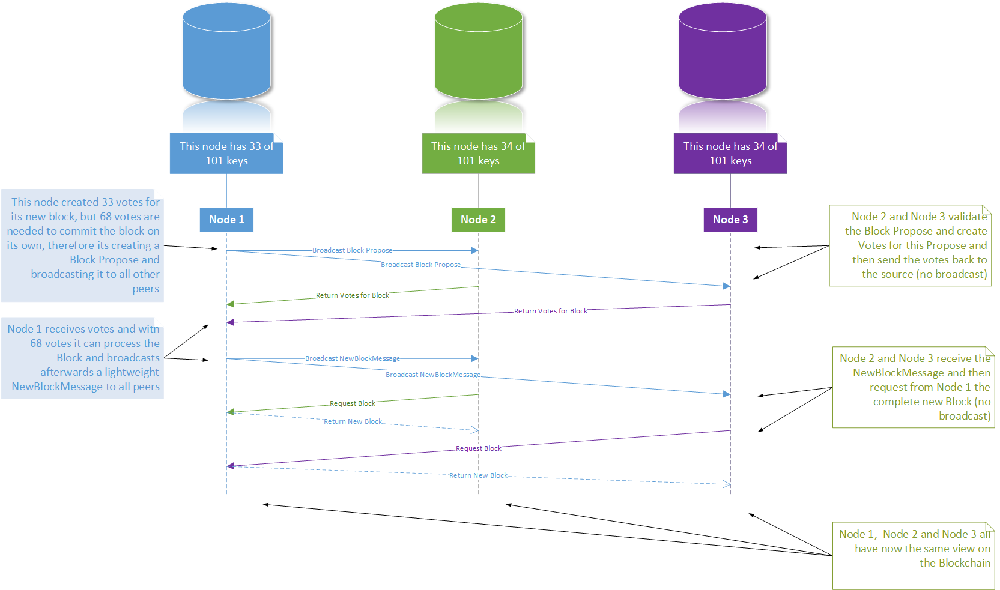

# Package P2P

The P2P package uses the fantastic [js-libp2p](https://github.com/libp2p/js-libp2p) library.

## Configuration

By convention the port on which the P2P communication happens is the `http-api-port +1`.

The following picture shows the P2P communication in the network.



## Bundle

The bundle is the main component of the P2P package. It is responsible to subscribe to certain P2P topics (`'newBlockHeader'`, `'propose'`, `'transaction'`) and publish one of this topics when the time comes. The publish-subscribe mechanism uses a mesh network topology. Peers are stored in the `PeerBook` (which is part of the bundle) in a node. Peers are added to the `PeerBook` when:

- 1. A publish-subscribe message is received from another peer, then this peer is added to the `PeerBook`.
- 2. A new peer is discovered with a DHT (Distributed-Hash-Table) random walk.

> If a neighbor Peer goes offline it will **not be removed** from the PeerBook in the case that he will come back online. This should increase network stability. If one wants to know all connected peers one should use the method `getAllConnectedPeers(): SimplePeerInfo[]`.

### Bundle Initialization

```ts
const config = {
  peerInfo,
  config: {
    peerDiscovery: {
      bootstrap: {
        list: bootstrapNode
      }
    }
  }
};

const bundle = new Bundle(config, global.app.logger);
```

To **start** the bundle you need to call `bundle.start(): Promise<void>`

<br/>

### Bundle Methods

#### start: Promise\<void\>

This start the P2P node. This step is **mandatory**.

```ts
await bundle.start();
```

#### stop: Promise\<void\>

This stops the P2P node.

```ts
await bundle.stop();
```

<br/>

#### broadcastProposeAsync(data: Buffer): Promise\<void\>

This method broadcasts a BlockPropose to peers.

```ts
await bundle.broadcastProposeAsync(data);
```

#### broadcastTransactionAsync(data: Buffer): Promise\<void\>

This method broadcasts a Transaction to peers:

```ts
await broadcastTransactionAsync(data);
```

#### broadcastNewBlockHeaderAsync(data: Buffer): Promise\<void\>

This method broadcasts a BlockHeader instead of a whole Block (for performance reasons) to peers. Peers can get the Block from the peer:

```ts
await broadcastNewBlockHeaderAsync(data);
```

#### broadcastAsync(topic: string, data: Buffer): Proise\<void\>

This is a generic method that where a node can broadcast a random topic to its peers.

```ts
await broadcastAsync("test", data);
```

#### subscribeCustom(topic: string, handler: P2PSubscribeHandler): void

Example:

```ts
const handler: P2PSubscribeHandler = (message: message: P2PMessage) => {
  // do something with message
};

Peer.p2p.subscribeCustom(
  'newBlockHeader',
  handler,
);
```

#### getAllConnectedPeers(): SimplePeerInfo[]

This method is returning all Peers from the PeerBook that are **connected**.

```ts
const allConnectedPeers = bundle.getAllConnectedPeers();
console.log(JSON.stringify(allConnectedPeers, null, 2));
```

Results in:

```json
[
  {
    "id": {
      "id": "QmVTNMpLacyzEjPQyhGUCGmhCVBPBXai2FhFsfKyLoExUP",
      "pubKey": "CAASpgIwggEiMA0GCSqGSIb3DQEBAQUAA4IBDwAwggEKAoIBAQDUtSDoa4O9oFyyXSawNgNACbQd60UZ2/Zc4VcemCf4SDuXzd0y+E4QGrb/8/rLRRnmXu8n1fLV4D3mvY1gf6OPCMkHu4k/xDh+Y7KoBsBHxb4Wq16vv+coe5jGw/7tDpoFqeVKvNoJ/Xudjdl53/C03RGTlFIWP+llcwXIYWPwuPH/pAF3X+sDQedaoVHrDdxnpNuPelw0naNtopv7yK75esTdi3FDmkwxTFF9BzF+LlgScXiyiprlZgg36nFA5YRWgBqILwTyEVURjTuS6vwPiieUrjZfMOViTyEQWnQD88FHGeg2sGjrk+SGQ8/eWENPtLlpVvnbE/YT1pZgqQJHAgMBAAE="
    },
    "multiaddrs": [
      "/ip4/127.0.0.1/tcp/30001/p2p/QmVTNMpLacyzEjPQyhGUCGmhCVBPBXai2FhFsfKyLoExUP",
      "/ip4/10.0.2.15/tcp/30001/p2p/QmVTNMpLacyzEjPQyhGUCGmhCVBPBXai2FhFsfKyLoExUP"
    ],
    "simple": {
      "port": 30001,
      "host": "127.0.0.1"
    }
  }
]
```

#### getConnectedRandomNode(): PeerNode | undefined

This method returns a **random connected Peer** from the PeerBook. If no Peers are in the PeerBook present then `undefined` is returned.

```ts
const peer = bundle.getConnectedRandomNode();
console.log(JSON.stringify(peer, null, 2));
```

This results in:

```json
{
  "host": "127.0.0.1",
  "port": 14000
}
```
