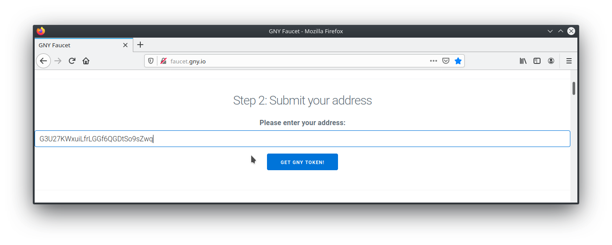

# Get GNY on testnet

Head to [faucet.gny.io](http://faucet.gny.io).

Be sure to have an existing GNY address.

::: tip
See guide [create secret](./create-secret.md) to create a new secret and its address
:::

::: tip
See guide [show address from secret](./show-address-from-secret.md) to see the address of a secret
:::

<!-- address: GuPmGpiHfdnokkABdgimn21v24qj -->

We will use the address `GuPmGpiHfdnokkABdg...` for our example.

Paste **your** address into the input field in the `Step 2` section on [`faucet.gny.io`](faucet.gny.io):

::: tip
Check your `GNY token balance with the [check balance](./check-balance.md) guide

It can take a few seconds for the balance to be shown
:::
