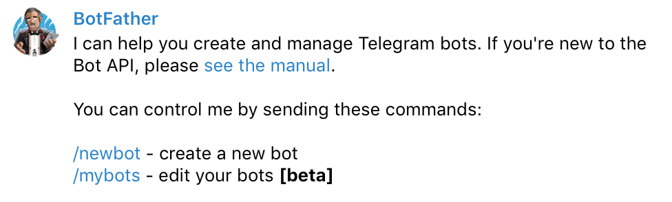
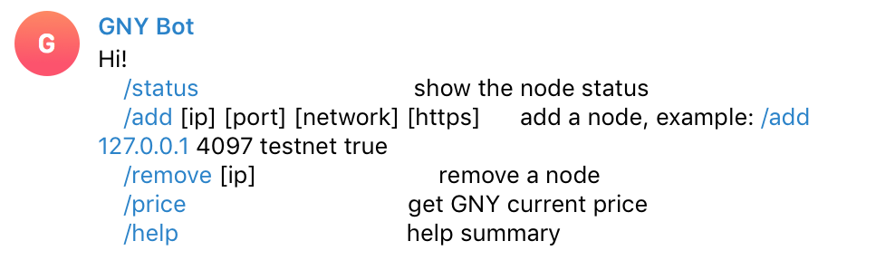
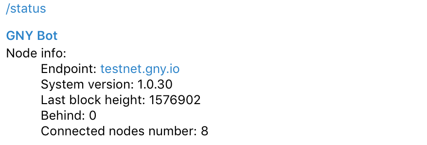

# How to configure a GNY monitoring bot with Telegram

## Register a new telegram bot

Please read this doc about [how to create a new bot by BotFather](https://core.telegram.org/bots#creating-a-new-bot). BotFather is also a telegram bot which helps you create new bots and change settings for your bots. You should remember your bot token.



## Deloy the bot backend

- Clone `gny-telegram-bot`

```bash
git clone https://github.com/GNYIO/gny-telegram-bot.git

```

- Deploy the backend to heroku

```
# Create the app
heroku create gny-telegram-bot

# Push to heroku
git push heroku master

# Change to worker instance
heroku ps:scale worker=1
```

> You can deploy the bot backend to any platform or VPS. Here we use Heorku just for its convenience and free plan.

- Create database

```

heroku addons:create heroku-postgresql:hobby-dev

```

After running this command, a DATABASE_URL config var is added to your app’s configuration. You can also add it to heroku settings on the web page manually.

- Add envronment variables
  - `TELEGRAM_BOT_TOKEN`: your bot token given by BotFather

* Some usefule heorku commands

```
heroku restart

heroku logs --tail

heroku pg:psql
```

## Commands



- `/status`: show the node status



- `/add [ip] [port] [network] [https]`: add a node
  - `/add testnet.gny.io 443 testnet true`


- `/remove [ip]`: remove a node


- `/price`: get GNY current price


- `/help`: help summary

> You can add any command by yourself. Here is [TeleBot usage](https://github.com/mullwar/telebot) for your reference.
