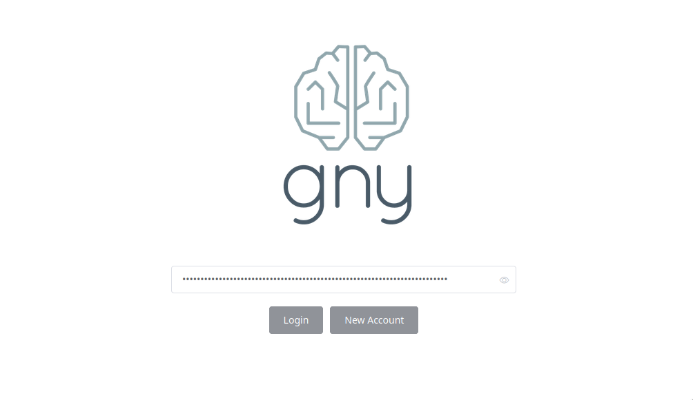
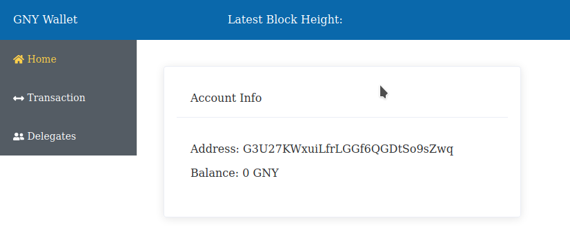

# Show address from secret

## With Wallet

When you login into the GNY wallet on [wallet.gny.io](http://wallet.gny.io) you need to type your `secret`. After login you will see your address.

Example:

