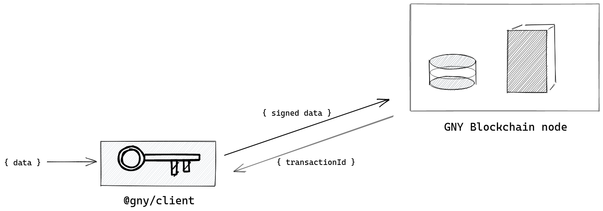

# HTTP API

## 1 API Usage Guide

### 1.1 Request Process Overview

- **Generate request data:** according to the interface specification you need to generate the request with a valid JSON object. The prefered way to do this is with the [@gny/client](../client).
- **Send request data:** transfer the generated data to the GNY Blockchain also with [@gny/client](../client).
- **GNY Blockchain handles data object:** after receiving the data object, the GNY Blockchain will validate the data first and edit to a block if all checks pass.
- **Return the response data:** The GNY Blockchain returns the transaction id upon successful execution. See the corresponding endpoint specification for detail.
- **Client handles the response data**

::: tip
The [@gny/client](../client) is the preferred way to communicate with the HTTP API

Head to the [@gny/client](../client) documentation for details


:::

## 2 Interface

### 2.1 Accounts

#### 2.1.1 Read Account

##### 2.1.1.1 Read Account with PublicKey

API Endpoint: `/api/accounts/openAccount`  
HTTP Verb: POST  
Supported Format: JSON  
Request Parameter Description:

| Name      | Type   | Required | Description   |
| --------- | ------ | -------- | ------------- |
| publicKey | string | Y        | GNY publicKey |

Response Parameter Description:

| Name    | Type | Description                 |
| ------- | ---- | --------------------------- |
| success | bool | Whether login is successful |
| account | json | Account information         |

:::: tabs

::: tab mainnet
Request Example:

```bash
curl -X POST --data "publicKey=41d36d74761593dcf1380faafcd487b84e014eba27c044d1aa87782d1cbd1a19" https://mainnet.gny.io/api/accounts/openAccount/
```

JSON Response Example:

```json
{
  "account": {
    "address": "G2QEzc5BndQ2h6BsSNqimCWbSBV9L",
    "balance": "20000000000",
    "secondPublicKey": null,
    "lockHeight": "0",
    "lockAmount": "0",
    "isDelegate": 0,
    "username": null,
    "publicKey": "a87c7230d9ade987dbf612605aab652667e6303d2a1c6b2ec91a13733593bb75"
  },
  "latestBlock": {
    "height": 53,
    "timestamp": 3471490
  },
  "version": {
    "version": "1.0.0",
    "build": "Sun Feb 02 2020 19:42:18 GMT+0100 (Central European Standard Time)",
    "net": "mainnet"
  }
}
```

:::

::: tab testnet

Request Example:

```bash
curl -X POST --data "publicKey=41d36d74761593dcf1380faafcd487b84e014eba27c044d1aa87782d1cbd1a19" http://testnet.gny.io/api/accounts/openAccount/
```

JSON Response Example:

```json
{
  "account": {
    "address": "G2QEzc5BndQ2h6BsSNqimCWbSBV9L",
    "balance": "20000000000",
    "secondPublicKey": null,
    "lockHeight": "0",
    "lockAmount": "0",
    "isDelegate": 0,
    "username": null,
    "publicKey": "a87c7230d9ade987dbf612605aab652667e6303d2a1c6b2ec91a13733593bb75"
  },
  "latestBlock": {
    "height": 53,
    "timestamp": 3471490
  },
  "version": {
    "version": "1.0.0",
    "build": "Sun Feb 02 2020 19:42:18 GMT+0100 (Central European Standard Time)",
    "net": "testnet"
  }
}
```

:::

::::

#### 2.1.2 Get Account Information

API Endpoint: `/api/accounts`  
HTTP Verb: GET  
Supported Format: urlencoded  
Request Parameter Description:

| Name     | Type   | Required | Description      |
| -------- | ------ | -------- | ---------------- |
| address  | string | N        | account address  |
| username | string | N        | account username |

Response Parameter Description:

| Name        | Type | Description                           |
| ----------- | ---- | ------------------------------------- |
| success     | bool | whether response data can be returned |
| account     | json | account information                   |
| latestBlock | json | latest block information              |
| version     | json | version information                   |

:::: tabs

::: tab mainnet

Request Example (address):

```bash
curl -k -X GET https://mainnet.gny.io/api/accounts?address=G4b8BhmeRFBmWAHZemKD25BmEP2G
```

Request Example (username):

```bash
curl -k -X GET https://mainnet.gny.io/api/accounts?username=liangpeili
```

JSON Response Example (address):

```json
{
  "account": {
    "address": "G3wAwmGh3rimRm9v4qjuh7RkkAebM",
    "balance": 2000000000000,
    "secondPublicKey": "",
    "lockHeight": 0
  },
  "latestBlock": {
    "height": 5,
    "timestamp": 3472080
  },
  "version": {
    "version": "1.0.0",
    "build": "Sun Feb 02 2020 19:46:48 GMT+0100 (Central European Standard Time)",
    "net": "mainnet"
  }
}
```

JSON Response Example (username):

```json
{
  "address": "G3wAwmGh3rimRm9v4qjuh7RkkAebM",
  "username": "liangpeili",
  "gny": 2000000000000,
  "publicKey": null,
  "secondPublicKey": null,
  "isDelegate": 1,
  "isLocked": 0,
  "lockHeight": 0,
  "lockAmount": 0,
  "_version_": 3
}
```

:::

::: tab testnet

Request Example (address):

```bash
curl -k -X GET http://testnet.gny.io/api/accounts?address=G4b8BhmeRFBmWAHZemKD25BmEP2G
```

Request Example (username):

```bash
curl -k -X GET http://testnet.gny.io/api/accounts?username=liangpeili
```

JSON Response Example (address):

```json
{
  "account": {
    "address": "G3wAwmGh3rimRm9v4qjuh7RkkAebM",
    "balance": 2000000000000,
    "secondPublicKey": "",
    "lockHeight": 0
  },
  "latestBlock": {
    "height": 5,
    "timestamp": 3472080
  },
  "version": {
    "version": "1.0.0",
    "build": "Sun Feb 02 2020 19:46:48 GMT+0100 (Central European Standard Time)",
    "net": "testnet"
  }
}
```

JSON Response Example (username):

```json
{
  "address": "G3wAwmGh3rimRm9v4qjuh7RkkAebM",
  "username": "liangpeili",
  "gny": 2000000000000,
  "publicKey": null,
  "secondPublicKey": null,
  "isDelegate": 1,
  "isLocked": 0,
  "lockHeight": 0,
  "lockAmount": 0,
  "_version_": 3
}
```

:::

::::

#### 2.1.3 Get Balance of Account

API Endpoint: `/api/accounts/getBalance`  
HTTP Verb: GET  
Supported Format: urlencoded  
Request Parameter Description:

| Name    | Type   | Required | Description      |
| ------- | ------ | -------- | ---------------- |
| address | string | Y        | Client's address |
| limit   | number | N        |                  |
| offset  | number | N        |                  |

Response Parameter Description:

| Name     | Type   | Description                             |
| -------- | ------ | --------------------------------------- |
| success  | bool   | true: response data return successfully |
| count    | number | the total number of available balances  |
| balances | Array  | list of balances                        |

:::: tabs

::: tab mainnet

Request Example:

```bash
curl -k -X GET 'https://mainnet.gny.io/api/accounts/getBalance?address=GJX8DYKb7mF3M6JCUhBqYnLiha6y'
```

JSON Response Example:

```js
{
  "success": true,
  "balances": [
    {
      "gny": "0"
    }
  ]
}
```

:::

::: tab testnet

Request Example:

```bash
curl -k -X GET 'http://testnet.gny.io/api/accounts/getBalance?address=GJX8DYKb7mF3M6JCUhBqYnLiha6y'
```

JSON Response Example:

```js
{
  "success": true,
  "balances": [
    {
      "gny": "0"
    }
  ]
}
```

:::

::::

<!--
#### 2.1.4 Get Account's Public Key

API Endpoint: `/api/accounts/getPublickey`
Request Method: GET
Supported Format: urlencoded
Request Parameter Description:

| Name    | Type   | Required | Description                        |
| ------- | ------ | -------- | ---------------------------------- |
| address | string | Y        | account's address              |

Response Parameter Description:

| Name      | Type   | Description                             |
| --------- | ------ | --------------------------------------- |
| success   | bool   | true: response data return successfully |
| publicKey | string | public key                              |

Request Example:

```bash
curl -k -X GET 'http://testnet.gny.io/api/accounts/getPublickey?address=GJX8DYKb7mF3M6JCUhBqYnLiha6y'
```

JSON Response Example:

```js
{
	"success": true,
	"publicKey": "ae256559d06409435c04bd62628b3e7ea3894c43298556f52b1cfb01fb3e3dc7"
}
```

-->

### 2.2 Transactions

#### 2.2.1 Get the Transaction Detail Information

API Endpoint: `/api/transactions`  
HTTP Verb: GET  
Supported Format: urlencoded  
Comment： if there is no parameter in request data, all transactions will be returned.

Request Parameter Description:

| Name            | Type     | Required              | Description                                                                                         |
| --------------- | -------- | --------------------- | --------------------------------------------------------------------------------------------------- |
| limit           | integer  | N                     | the limitation of returned records，minimum：0,maximum：100                                         |
| offset          | integer  | N                     | offset, minimum 0                                                                                   |
| id              | string   | N                     | transaction id                                                                                      |
| senderId        | N        | GNY address of sender |
| senderPublicKey | string   | N                     | sender's public key                                                                                 |
| blockId         | string   | N                     | block id                                                                                            |
| height          | integer  | specific block height |
| type            | interger | N                     | Transaction type, see https://github.com/GNYIO/gny-general/wiki/Transactions for futher information |
| message         | string   | Transaction message   |

Response Parameter Description:

| Name         | Type  | Description                                                 |
| ------------ | ----- | ----------------------------------------------------------- |
| success      | bool  | true: response data return successfully                     |
| transactions | Array | A JSON object list containing multiple transactions' detail |
| count        | int   | the total number of available transactions                  |

:::: tabs

::: tab mainnet
Request Example:

```bash
curl -k -X GET 'https://mainnet.gny.io/api/transactions?recipientId=16723473400748954103&orderBy=t_timestamp:desc&limit=3'
```

JSON Response Example:

```js
{
  "transactions":[
    {
      "transactionId":"42254052d4bc1e1132c316469194e6b756a6c0f086a24b00c05a91ced5502046",
      "senderId":"G25AKCRu8mK2b4QXq8Jk8bFiNfxeY",
      "recipientId":"G2MdtJJPCWTFGZ75QoP7Z5KowRhst",
      "recipientName":null,
      "currency":"gny",
      "amount":"10000000000000000",
      "timestamp":0,
      "height":0,
      "_version_":1
    }
  ],
  "count":1
}
```

:::

::: tab testnet
Request Example:

```bash
curl -k -X GET 'http://testnet.gny.io/api/transactions?recipientId=16723473400748954103&orderBy=t_timestamp:desc&limit=3'
```

JSON Response Example:

```js
{
  "transactions":[
    {
      "transactionId":"42254052d4bc1e1132c316469194e6b756a6c0f086a24b00c05a91ced5502046",
      "senderId":"G25AKCRu8mK2b4QXq8Jk8bFiNfxeY",
      "recipientId":"G2MdtJJPCWTFGZ75QoP7Z5KowRhst",
      "recipientName":null,
      "currency":"gny",
      "amount":"10000000000000000",
      "timestamp":0,
      "height":0,
      "_version_":1
    }
  ],
  "count":1
}
```

:::

::::

#### 2.2.3 Get Transaction Detail by Unconfirmed Transaction ID

API Endpoint: `/api/transactions/unconfirmed/get`  
HTTP Verb: GET  
Supported Format: urlencoded  
Info: A unconfirmed transaction is only available up to 10 seconds until it is confirmed
Request Parameter Description:

| Name | Type   | Required | Description                |
| ---- | ------ | -------- | -------------------------- |
| id   | string | Y        | unconfirmed transaction id |

Response Parameter Description:

| Name        | Type | Description                                |
| ----------- | ---- | ------------------------------------------ |
| success     | bool | true: response data return successfully    |
| transaction | json | unconfirmed transaction detail inforamtion |

:::: tabs

::: tab mainnet
Request Example:

```bash
curl -k -X GET 'https://mainnet.gny.io/api/transactions/unconfirmed/get?id=1dd72aac3dd011754ea2ca80406014404acbe7550463232208c7ddaf63398c03'
```

JSON Response Example:

```js
{
  "transactionId":"42254052d4bc1e1132c316469194e6b756a6c0f086a24b00c05a91ced5502046",
  "senderId":"G25AKCRu8mK2b4QXq8Jk8bFiNfxeY",
  "recipientId":"G2MdtJJPCWTFGZ75QoP7Z5KowRhst",
  "recipientName":null,
  "currency":"gny",
  "amount":"10000000000000000",
  "timestamp":0,
  "height":0,
  "_version_":1
}
```

:::

::: tab testnet
Request Example:

```bash
curl -k -X GET 'http://testnet.gny.io/api/transactions/unconfirmed/get?id=1dd72aac3dd011754ea2ca80406014404acbe7550463232208c7ddaf63398c03'
```

JSON Response Example:

```js
{
  "transactionId":"42254052d4bc1e1132c316469194e6b756a6c0f086a24b00c05a91ced5502046",
  "senderId":"G25AKCRu8mK2b4QXq8Jk8bFiNfxeY",
  "recipientId":"G2MdtJJPCWTFGZ75QoP7Z5KowRhst",
  "recipientName":null,
  "currency":"gny",
  "amount":"10000000000000000",
  "timestamp":0,
  "height":0,
  "_version_":1
}
```

:::

::::

#### 2.2.4 Get Unconfirmed Transaction Detail Information [within all network]

API Endpoint: `/api/transactions/unconfirmed`  
HTTP Verb: GET  
Supported Format: urlencoded  
Comment: If there is no parameter, all unconfirmed transactions in the whole network will be returned.
Request Parameter Description:

| Name            | Type   | Required | Description         |
| --------------- | ------ | -------- | ------------------- |
| senderPublicKey | string | N        | sender's public key |
| address         | string | N        | address             |

Response Parameter Description:

| Name         | Type  | Description                                    |
| ------------ | ----- | ---------------------------------------------- |
| success      | bool  | true: response data return successfully        |
| transactions | Array | a list containing all unconfirmed transactions |

:::: tabs

::: tab mainnet

Request Example:

```bash
curl -k -X GET 'https://mainnet.gny.io/api/transactions/unconfirmed'
```

JSON Response Example:

```js
{
	"success": true,
	"transactions": []      //Currently there is no unconfirmed transaction in the whole network
}
```

:::

::: tab testnet
Request Example:

```bash
curl -k -X GET 'http://testnet.gny.io/api/transactions/unconfirmed'
```

JSON Response Example:

```js
{
	"success": true,
	"transactions": []      //Currently there is no unconfirmed transaction in the whole network
}
```

:::

::::

<br/>

#### 2.2.5 Get Count of confirmed Transaction

API Endpoint: `/api/transactions/count`  
HTTP Verb: GET  
Supported Format: urlencoded

Request Parameter Description:

| Name            | Required | Type   | Description                          |
| --------------- | -------- | ------ | ------------------------------------ |
| senderId        | N        | string | Optional `senderId` parameter        |
| senderPublicKey | N        | string | Optional `senderPublicKey` parameter |

Response Parameter Description:

| Name  | Type   | Description                                                      |
| ----- | ------ | ---------------------------------------------------------------- |
| count | number | the number of currently confirmed transactions on the Blockchain |

:::: tabs

::: tab mainnet

**1. Request Example** (count all transactions, from all users):

```bash
curl -k -X GET 'https://mainnet.gny.io/api/transactions/count'
```

JSON Response Example:

```js
{
	"count": 203
}
```

<br/>

**2. Request Example** (count transactions of user, by `senderPublicKey`):

```bash
curl -k -X GET 'https://mainnet.gny.io/api/transactions/count?senderPublicKey=1dcd1197d073e1ed3bba872572afda6b02dd926fa1e4454ec796bf4ec0313973'
```

JSON Response Example:

```js
{
	"count": 5
}
```

<br/>

**3. Request Example** (count transactions of user, by `senderId`):

```bash
curl -k -X GET 'https://mainnet.gny.io/api/transactions/count?senderId=G3TCoN8jRQenDPRLKj3wEx4DkXKy4'
```

```js
{
	"count": 10
}
```

:::

::: tab testnet
**1. Request Example** (count all transactions, from all users):

```bash
curl -k -X GET 'https://testnet.gny.io/api/transactions/count'
```

JSON Response Example:

```js
{
	"count": 203
}
```

<br/>

**2. Request Example** (count transactions of user, by `senderPublicKey`):

```bash
curl -k -X GET 'https://testnet.gny.io/api/transactions/count?senderPublicKey=8ea683cbaf24286001f266fe2f676ed7ec88cc5e585b696410b23c251420276d'
```

JSON Response Example:

```js
{
	"count": 5
}
```

<br/>

**3. Request Example** (count transactions of user, by `senderId`):

```bash
curl -k -X GET 'https://testnet.gny.io/api/transactions/count?senderId=G43MMwsCg41JupFvddvwM4vQkjhRt'
```

JSON Response Example:

```js
{
	"count": 10
}
```

:::

::::

<br/>

#### 2.2.6 Get Transactions, newest first

API Endpoint: `/api/transactions/newestFirst`  
HTTP Verb: GET  
Supported Format: urlencoded

Request Parameter Description:

| Name            | Type   | Required | Description                                                                                                                                                                                                                                                                                                                                                                                                                                                                                                                                                                                                                                                                                                                                                                                                                        |
| --------------- | ------ | -------- | ---------------------------------------------------------------------------------------------------------------------------------------------------------------------------------------------------------------------------------------------------------------------------------------------------------------------------------------------------------------------------------------------------------------------------------------------------------------------------------------------------------------------------------------------------------------------------------------------------------------------------------------------------------------------------------------------------------------------------------------------------------------------------------------------------------------------------------- |
| count           | number | Y        | The `count` paramter is required. New transactions can be added to the Blockchain every second and which transaction are the newest and get returned by this endpoint **changes** when new transactions arrive. If the total transaction count changes between two HTTP requests, then the starting point of the counting would change. This would lead to inconsistent result. This makes this parameter mandatory. Therefore it is advised to first fetch the current count of all transactions (`/api/transactions/count`) and pass it then to this endpoint (`/api/transactions/newestFirst?count=123`). If the `count` parameter is passed in, the returned values are consistent. Then paging can be used with `?count=123&offset=0` and then `?count=123&offset=100` to get the first 100 transactions and then the next 23 |
| limit           | number | N        | maximum number of returned records, between 0 and 100                                                                                                                                                                                                                                                                                                                                                                                                                                                                                                                                                                                                                                                                                                                                                                              |
| offset          | number | N        | default is 0                                                                                                                                                                                                                                                                                                                                                                                                                                                                                                                                                                                                                                                                                                                                                                                                                       |
| senderId        | string | N        | Optional parameter `senderId`. This can be used to filter for the `senderId` of all transactions                                                                                                                                                                                                                                                                                                                                                                                                                                                                                                                                                                                                                                                                                                                                   |
| senderPublicKey | sring  | N        | Optional parameter `senderPublicKey`. This can be used to filter for the `senderPublicKey` of all transactions                                                                                                                                                                                                                                                                                                                                                                                                                                                                                                                                                                                                                                                                                                                     |

Response Parameter Description:

| Name         | Type  | Description                                    |
| ------------ | ----- | ---------------------------------------------- |
| success      | bool  | true: response data return successfully        |
| transactions | Array | a list containing all unconfirmed transactions |

:::: tabs

::: tab mainnet

**1. Request Example** (for all users):

```bash
# first fetch current count of confirmed transactions
curl -k -X GET 'https://mainnet.gny.io/api/transactions/count'
# then get the newest transactions by passing the count to the endpoint
curl -k -X GET 'https://mainnet.gny.io/api/transactions/newestFirst?count=123'
```

First JSON Response Example:

```js
{
	"count": 203
}
```

Second JSON Response Example:

```js
"transactions":[
    {
      "transactionId":"42254052d4bc1e1132c316469194e6b756a6c0f086a24b00c05a91ced5502046",
      "senderId":"G25AKCRu8mK2b4QXq8Jk8bFiNfxeY",
      "recipientId":"G2MdtJJPCWTFGZ75QoP7Z5KowRhst",
      "recipientName":null,
      "currency":"gny",
      "amount":"10000000000000000",
      "timestamp":0,
      "height":0,
      "_version_":1
    },
    // ...
  ],
  "count":203
```

<br/>

**2. Request Example** (for user, by `senderPublicKey`):

```bash
# first fetch current count of confirmed transactions
curl -k -X GET 'https://mainnet.gny.io/api/transactions/count?senderPublicKey=8ea683cbaf24286001f266fe2f676ed7ec88cc5e585b696410b23c251420276d'
# then get the newest transactions by passing the count to the endpoint
curl -k -X GET 'https://mainnet.gny.io/api/transactions/newestFirst?count=123&senderPublicKey=8ea683cbaf24286001f266fe2f676ed7ec88cc5e585b696410b23c251420276d'
```

First JSON Response Example:

```js
{
	"count": 5
}
```

Second JSON Response Example:

```js
"transactions":[
    {
      "transactionId":"42254052d4bc1e1132c316469194e6b756a6c0f086a24b00c05a91ced5502046",
      "senderId":"G25AKCRu8mK2b4QXq8Jk8bFiNfxeY",
      "recipientId":"G2MdtJJPCWTFGZ75QoP7Z5KowRhst",
      "recipientName":null,
      "currency":"gny",
      "amount":"10000000000000000",
      "timestamp":0,
      "height":0,
      "_version_":1
    },
    // ...
  ],
  "count":5
```

<br/>

**3. Request Example** (for user, by `senderId`):

```bash
# first fetch current count of confirmed transactions
curl -k -X GET 'https://mainnet.gny.io/api/transactions/count?senderId=G4XwKvHy6AFCXV8XQK4cqDYsbhiPp'
# then get the newest transactions by passing the count to the endpoint
curl -k -X GET 'https://mainnet.gny.io/api/transactions/newestFirst?count=123&senderId=G4XwKvHy6AFCXV8XQK4cqDYsbhiPp'
```

First JSON Response Example:

```js
{
	"count": 10
}
```

Second JSON Response Example:

```js
"transactions":[
    {
      "transactionId":"42254052d4bc1e1132c316469194e6b756a6c0f086a24b00c05a91ced5502046",
      "senderId":"G25AKCRu8mK2b4QXq8Jk8bFiNfxeY",
      "recipientId":"G2MdtJJPCWTFGZ75QoP7Z5KowRhst",
      "recipientName":null,
      "currency":"gny",
      "amount":"10000000000000000",
      "timestamp":0,
      "height":0,
      "_version_":1
    },
    // ...
  ],
  "count":10
```

:::

::: tab testnet

**1. Request Example** (for all users):

```bash
# first fetch current count of confirmed transactions
curl -k -X GET 'https://testnet.gny.io/api/transactions/count'
# then get the newest transactions by passing the count to the endpoint
curl -k -X GET 'https://testnet.gny.io/api/transactions/newestFirst?count=123'
```

First JSON Response Example:

```js
{
	"count": 203
}
```

Second JSON Response Example:

```js
"transactions":[
    {
      "transactionId":"42254052d4bc1e1132c316469194e6b756a6c0f086a24b00c05a91ced5502046",
      "senderId":"G25AKCRu8mK2b4QXq8Jk8bFiNfxeY",
      "recipientId":"G2MdtJJPCWTFGZ75QoP7Z5KowRhst",
      "recipientName":null,
      "currency":"gny",
      "amount":"10000000000000000",
      "timestamp":0,
      "height":0,
      "_version_":1
    },
    // ...
  ],
  "count":203
```

<br/>

**2. Request Example** (for user, by `senderPublicKey`):

```bash
# first fetch current count of confirmed transactions
curl -k -X GET 'https://testnet.gny.io/api/transactions/count?senderPublicKey=8ea683cbaf24286001f266fe2f676ed7ec88cc5e585b696410b23c251420276d'
# then get the newest transactions by passing the count to the endpoint
curl -k -X GET 'https://testnet.gny.io/api/transactions/newestFirst?count=123&senderPublicKey=8ea683cbaf24286001f266fe2f676ed7ec88cc5e585b696410b23c251420276d'
```

First JSON Response Example:

```js
{
	"count": 5
}
```

Second JSON Response Example:

```js
"transactions":[
    {
      "transactionId":"42254052d4bc1e1132c316469194e6b756a6c0f086a24b00c05a91ced5502046",
      "senderId":"G25AKCRu8mK2b4QXq8Jk8bFiNfxeY",
      "recipientId":"G2MdtJJPCWTFGZ75QoP7Z5KowRhst",
      "recipientName":null,
      "currency":"gny",
      "amount":"10000000000000000",
      "timestamp":0,
      "height":0,
      "_version_":1
    },
    // ...
  ],
  "count":5
```

<br/>

**3. Request Example** (for user, by `senderId`):

```bash
# first fetch current count of confirmed transactions
curl -k -X GET 'https://testnet.gny.io/api/transactions/count?senderId=G4XwKvHy6AFCXV8XQK4cqDYsbhiPp'
# then get the newest transactions by passing the count to the endpoint
curl -k -X GET 'https://testnet.gny.io/api/transactions/newestFirst?count=123&senderId=G4XwKvHy6AFCXV8XQK4cqDYsbhiPp'
```

First JSON Response Example:

```js
{
	"count": 10
}
```

Second JSON Response Example:

```js
"transactions":[
    {
      "transactionId":"42254052d4bc1e1132c316469194e6b756a6c0f086a24b00c05a91ced5502046",
      "senderId":"G25AKCRu8mK2b4QXq8Jk8bFiNfxeY",
      "recipientId":"G2MdtJJPCWTFGZ75QoP7Z5KowRhst",
      "recipientName":null,
      "currency":"gny",
      "amount":"10000000000000000",
      "timestamp":0,
      "height":0,
      "_version_":1
    },
    // ...
  ],
  "count":10
```

:::

::::

<br/>

### 2.3 Blocks

#### 2.3.1 Get the Block Detail Information of the Given ID

API Endpoint: `/api/blocks/getBlock`  
HTTP Verb: GET  
Supported Format: urlencoded  
Request Parameter Description:

| Name   | Type   | Required                                  | Description  |
| ------ | ------ | ----------------------------------------- | ------------ |
| id     | string | only choose one of these three parameters | block ID     |
| height | string | ditto                                     | block height |

Response Parameter Description:

| Name    | Type | Description                             |
| ------- | ---- | --------------------------------------- |
| success | bool | true: response data return successfully |
| block   | json | the block detail information            |

:::: tabs

::: tab mainnet
Request Example:

```bash
curl -k -X GET 'https://mainnet.gny.io/api/blocks/getBlock?id=fed53e3ad0a1405f73122708ee53dfed2e9eccc34693d52043bdb6aec4751a8c'
```

JSON Response Example:

```js
{
  "block":{
    "version":0,
    "payloadHash":"3d2215b8d226b5a38ace219d0ab3f4d84830fd54a832dc05540e20ef81a00547",
    "timestamp":0,
    "delegate":"61ca23509390845f06ccaa43384e889074dfd0c821e4ba3894f8e62b6a31895a",
    "height":0,
    "count":203,
    "fees":0,
    "reward":0,
    "signature":"d49b0d08b164c8df402dc1f24430d51126a05a9d1c4012fbdf89272ab95740454b11fd4b44dbf7c60d4757760d8015146433ae21e2e418fd0d7b3aa03adc5503",
    "id":"fed53e3ad0a1405f73122708ee53dfed2e9eccc34693d52043bdb6aec4751a8c"
  }
}
```

:::

::: tab testnet
Request Example:

```bash
curl -k -X GET 'http://testnet.gny.io/api/blocks/getBlock?id=fed53e3ad0a1405f73122708ee53dfed2e9eccc34693d52043bdb6aec4751a8c'
```

JSON Response Example:

```js
{
  "block":{
    "version":0,
    "payloadHash":"3d2215b8d226b5a38ace219d0ab3f4d84830fd54a832dc05540e20ef81a00547",
    "timestamp":0,
    "delegate":"61ca23509390845f06ccaa43384e889074dfd0c821e4ba3894f8e62b6a31895a",
    "height":0,
    "count":203,
    "fees":0,
    "reward":0,
    "signature":"d49b0d08b164c8df402dc1f24430d51126a05a9d1c4012fbdf89272ab95740454b11fd4b44dbf7c60d4757760d8015146433ae21e2e418fd0d7b3aa03adc5503",
    "id":"fed53e3ad0a1405f73122708ee53dfed2e9eccc34693d52043bdb6aec4751a8c"
  }
}
```

:::

::::

#### 2.3.2 Get the Latest Block

API Endpoint: `/api/blocks`  
HTTP Verb: GET  
Supported Format: urlencoded  
Comment: if there is no parameter, the detail of all the blocks in the whole network will be returned  
Request Parameter Description:

| Name         | Type    | Required | Description                                                                                                                                              |
| ------------ | ------- | -------- | -------------------------------------------------------------------------------------------------------------------------------------------------------- |
| limit        | integer | N        | maximum number of returned records, between 0 and 100                                                                                                    |
| offset       | integer | N        | default is 0                                                                                                                                             |
| orderBy      | string  | N        | sort by a field in the table, for example, specify `height:desc` to sort descending, default is `height:asc`. You can only sort by the `height` property |
| transactions | boolean | N        | When transactions=true then                                                                                                                              |

Response Parameter Description:

| Name    | Type    | Description                                    |
| ------- | ------- | ---------------------------------------------- |
| success | bool    | true: response data return successfully        |
| blocks  | Array   | a list of JSON objects containing block detail |
| count   | integer | block height                                   |

:::: tabs

::: tab mainnet
Request Example:

```bash
curl -k -X GET 'https://mainnet.gny.io/api/blocks?limit=2&offset=0&orderBy=height:desc'
```

JSON Response Example:

```js
{
"count":56,
"blocks":[
  {
    "version":0,
    "delegate":"ee9191dff690c0a5b74bba5ab4bddeff60042154d66f2d5c7111123ae8cb4396",
    "height":55,
    "prevBlockId":"f8d9d54ab0fbbeec1063472a9296e24e8336866de3b0ad5d514fd92ddc73b539",
    "timestamp":3621850,
    "count":0,
    "fees":0,
    "payloadHash":"e3b0c44298fc1c149afbf4c8996fb92427ae41e4649b934ca495991b7852b855",
    "reward":0,
    "signature":"81b0090adc75346c8985ebe2c6341ba36eeb4b48a2a66ec69b701d55e35577f0dbdd5a633627098a7a64cb81dd1a9d6fbf13f7c0983fd162f46ef12c5468840f",
    "id":"e70c0b569ca877d262dadcd1967a02427a9996d8c189ee32b7c8bcff7fa3cff2"
  },
  {
    "version":0,
    "delegate":"adc2fdf3174278b2d88f9a37d795fb720ab7530f72367e0aae863143b4b90259",
    "height":54,
    "prevBlockId":"c3e75c7862a7cbe7f1933837704700bd158c2bd9fc6d1228327323003a0cdd15",
    "timestamp":3620770,
    "count":0,
    "fees":0,
    "payloadHash":"e3b0c44298fc1c149afbf4c8996fb92427ae41e4649b934ca495991b7852b855",
    "reward":0,
    "signature":"a17bf15385b65dd84e94a7be6ccd635dc291f63b8128dd4951f7544fafa0632fc281e70dd597ae2770b228bdb581fd182f98fda7dc4a2d82cf8e94ff344ef604",
    "id":"f8d9d54ab0fbbeec1063472a9296e24e8336866de3b0ad5d514fd92ddc73b539"
  }
]}
```

:::

::: tab testnet
Request Example:

```bash
curl -k -X GET 'http://testnet.gny.io/api/blocks?limit=2&offset=0&orderBy=height:desc'
```

JSON Response Example:

```js
{
"count":56,
"blocks":[
  {
    "version":0,
    "delegate":"ee9191dff690c0a5b74bba5ab4bddeff60042154d66f2d5c7111123ae8cb4396",
    "height":55,
    "prevBlockId":"f8d9d54ab0fbbeec1063472a9296e24e8336866de3b0ad5d514fd92ddc73b539",
    "timestamp":3621850,
    "count":0,
    "fees":0,
    "payloadHash":"e3b0c44298fc1c149afbf4c8996fb92427ae41e4649b934ca495991b7852b855",
    "reward":0,
    "signature":"81b0090adc75346c8985ebe2c6341ba36eeb4b48a2a66ec69b701d55e35577f0dbdd5a633627098a7a64cb81dd1a9d6fbf13f7c0983fd162f46ef12c5468840f",
    "id":"e70c0b569ca877d262dadcd1967a02427a9996d8c189ee32b7c8bcff7fa3cff2"
  },
  {
    "version":0,
    "delegate":"adc2fdf3174278b2d88f9a37d795fb720ab7530f72367e0aae863143b4b90259",
    "height":54,
    "prevBlockId":"c3e75c7862a7cbe7f1933837704700bd158c2bd9fc6d1228327323003a0cdd15",
    "timestamp":3620770,
    "count":0,
    "fees":0,
    "payloadHash":"e3b0c44298fc1c149afbf4c8996fb92427ae41e4649b934ca495991b7852b855",
    "reward":0,
    "signature":"a17bf15385b65dd84e94a7be6ccd635dc291f63b8128dd4951f7544fafa0632fc281e70dd597ae2770b228bdb581fd182f98fda7dc4a2d82cf8e94ff344ef604",
    "id":"f8d9d54ab0fbbeec1063472a9296e24e8336866de3b0ad5d514fd92ddc73b539"
  }
]}
```

:::

::::

#### 2.3.3 Get the Block Height

API Endpoint: `/api/blocks/getHeight`  
HTTP Verb: GET  
Supported Format: none  
Request Parameter Description: none

Response Parameter Description:

| Name    | Type    | Description                             |
| ------- | ------- | --------------------------------------- |
| success | bool    | true: response data return successfully |
| height  | integer | block height                            |

:::: tabs

::: tab mainnet

Request Example:

```bash
curl -k -X GET 'https://mainnet.gny.io/api/blocks/getheight'
```

JSON Response Example:

```js
{
  "success":true,
  "height":140569
}
```

:::

::: tab testnet
Request Example:

```bash
curl -k -X GET 'http://testnet.gny.io/api/blocks/getheight'
```

JSON Response Example:

```js
{
  "success":true,
  "height":140569
}
```

:::

::::

#### 2.3.5 Get the Milestone

API Endpoint: `/api/blocks/getMilestone`  
HTTP Verb: GET  
Supported Format: none  
Request Parameter Description: none  
Response Parameter Description:

| Name      | Type    | Description                             |
| --------- | ------- | --------------------------------------- |
| success   | bool    | true: response data return successfully |
| milestone | integer |                                         |

:::: tabs

::: tab mainnet

```bash
curl -k -X GET 'https://mainnet.gny.io/api/blocks/getMilestone'
```

JSON Response Example:

```js
{
  "success":true,
  "milestone":0
}
```

:::

::: tab testnet

```bash
curl -k -X GET 'http://testnet.gny.io/api/blocks/getMilestone'
```

JSON Response Example:

```js
{
  "success":true,
  "milestone":0
}
```

:::

::::

Request Example:

#### 2.3.6 Get the Reward Information of a Block

API Endpoint: `/api/blocks/getReward`  
Request Method: GET  
Supported Format: none  
Request Parameter Description: none

Response Parameter Description:

| Name    | Type    | Description                             |
| ------- | ------- | --------------------------------------- |
| success | bool    | true: response data return successfully |
| reward  | integer | the reward of the block                 |

:::: tabs

::: tab mainnet
Request Example:

```bash
curl -k -X GET 'https://mainnet.gny.io/api/blocks/getReward'
```

JSON Response Example:

```js
{
  "success":true,
  "reward":200000000
} // every single block that is created will be rewarded by
```

:::

::: tab testnet
Request Example:

```bash
curl -k -X GET 'http://testnet.gny.io/api/blocks/getReward'
```

JSON Response Example:

```js
{
  "success":true,
  "reward":200000000
} // every single block that is created will be rewarded by
```

:::

::::

#### 2.3.7 Get the Current Maximum Supply of the Blockchain

API Endpoint: `/api/blocks/getSupply`  
HTTP Verb: GET  
Supported Format: none  
Request Parameter Description: none

Response Parameter Description:

| Name    | Type    | Description                                  |
| ------- | ------- | -------------------------------------------- |
| success | bool    | true: response data return successfully      |
| supply  | integer | the total amount of XAS in the whole network |

:::: tabs

::: tab mainnet
Request Example:

```bash
curl -k -X GET 'https://mainnet.gny.io/api/blocks/getSupply'
```

JSON Response Example:

```js
{
  "supply":"10000000000000000"
}
```

:::

::: tab testnet
Request Example:

```bash
curl -k -X GET 'http://testnet.gny.io/api/blocks/getSupply'
```

JSON Response Example:

```js
{
  "supply":"10000000000000000"
}
```

:::

::::

#### 2.3.8 Get Current Status of Blockchain

API Endpoint: `/api/blocks/getStatus`  
HTTP Verb: GET  
Supported Format: none  
Request Parameter Description: none

Response Parameter Description:

| Name      | Type    | Description                              |
| --------- | ------- | ---------------------------------------- |
| success   | bool    | true: response data return successfully  |
| height    | integer | blockchain height                        |
| fee       | integer | transaction fee                          |
| milestone | integer |                                          |
| reward    | integer | block reward                             |
| supply    | integer | total amount of XAS in the whole network |

:::: tabs

::: tab mainnet

```bash
curl -k -X GET 'https://mainnet.gny.io/api/blocks/getStatus'
```

JSON Response Example:

```js
{
  "height":11,
  "fee":10000000,
  "milestone":0,
  "reward":0,
  "supply":"10000000000000000"
}
```

:::

::: tab testnet

```bash
curl -k -X GET 'http://testnet.gny.io/api/blocks/getStatus'
```

JSON Response Example:

```js
{
  "height":11,
  "fee":10000000,
  "milestone":0,
  "reward":0,
  "supply":"10000000000000000"
}
```

:::

::::

Request Example:

### 2.4 Delegates

#### 2.4.1 Get the Total Number of Delegates

API Endpoint: `/api/delegates/count`  
HTTP Verb: GET  
Supported Format: none  
Request Parameter Description: none

Response Parameter Description:

| Name    | Type    | Description                             |
| ------- | ------- | --------------------------------------- |
| success | bool    | true: response data return successfully |
| count   | integer | total number of delegates               |

:::: tabs

::: tab mainnet
Request Example:

```bash
curl -k -X GET 'https://mainnet.gny.io/api/delegates/count'
```

JSON Response Example:

```js
{"success":true,"count":234}
```

:::

::: tab testnet
Request Example:

```bash
curl -k -X GET 'http://testnet.gny.io/api/delegates/count'
```

JSON Response Example:

```js
{"success":true,"count":234}
```

:::

::::

#### 2.4.2 Get the Voters for a Delegate

API Endpoint: `/api/delegates/getVoters`  
Request Method: GET  
Supported Format: urlencoded  
Request Parameter Description:

| Name     | Type   | Required | Description              |
| -------- | ------ | -------- | ------------------------ |
| username | string | Y        | username of the delegate |

Response Parameter Description:

| Name                 | Type   | Description                                                                                                                                                                                                                   |
| -------------------- | ------ | ----------------------------------------------------------------------------------------------------------------------------------------------------------------------------------------------------------------------------- |
| success              | bool   | true: response data return successfully                                                                                                                                                                                       |
| accounts             | Array  | an array of accounts that voted for this delegate. In order to vote one doesn't need to be delegate. It is enough to have some GNY tokens locked. Only the locked GNY tokens add to the weight of the delegate in the ranking |
| accounts[0].delegate | Object | The `delegate` object on an account object is entirely optional. The `delegate` object appears only if the the account that voted is also a `delegate`.                                                                       |

:::: tabs

::: tab mainnet
Request Example:

```bash
curl -k -X GET 'https://mainnet.gny.io/api/delegates/getVoters?username=gny_d1'
```

JSON Response Example:

```js
{
  "success": true,
  "accounts": [
    {
      "address": "G3uxh6H3iB4mmtPYnzvpT9itQHCzz",
      "username": null,
      "gny": "19980000000",
      "publicKey": null,
      "secondPublicKey": null,
      "isDelegate": 0,
      "isLocked": 1,
      "lockHeight": "2500000",
      "lockAmount": "20000000000",
      "_version_": 5,
      "balance": "19980000000",
      "weightRatio": "0.00004964719289781813"
    },
    {
      "address": "GAeE4cWpKxs33gMrbJ7B5TXKBBQE",
      "username": "www",
      "gny": "19450000000",
      "publicKey": null,
      "secondPublicKey": null,
      "isDelegate": 0,
      "isLocked": 1,
      "lockHeight": "2600000",
      "lockAmount": "40000000000",
      "_version_": 11,
      "balance": "19450000000",
      "weightRatio": "0.00009929438579563626"
    },
    {
      "address": "GXDgJFW9nnSKYomtZirW8SqDDnqW",
      "username": "tonyt_gny",
      "gny": "2988814356531",
      "publicKey": null,
      "secondPublicKey": null,
      "isDelegate": 1,
      "isLocked": 1,
      "lockHeight": "173400",
      "lockAmount": "89000000000",
      "_version_": 13687,
      "balance": "2988814356531",
      "weightRatio": "0.00022093000839529067",
      "delegate": {
        "address": "GXDgJFW9nnSKYomtZirW8SqDDnqW",
        "tid": "3332ffe9344877de18ede0294fee8b350d36992e89e61d1672e813a894e323db",
        "username": "tonyt_gny",
        "publicKey": "e6408dcb79ac12cb2e61d77b869a146081f554e73501608a686a809043de0b88",
        "votes": "557100000000",
        "producedBlocks": "25341",
        "missedBlocks": "812",
        "fees": "2334356531",
        "rewards": "2986000000000",
        "_version_": 24342,
        "rate": 1,
        "approval": "0.001382922558168724",
        "productivity": "0.96895193668030436279"
      }
    }
  ]
}
```

:::

::: tab testnet
Request Example:

```bash
curl -k -X GET 'http://testnet.gny.io/api/delegates/getVoters?username=gny_d1'
```

JSON Response Example:

```js
{
  "success": true,
  "accounts": [
    {
      "address": "G3uxh6H3iB4mmtPYnzvpT9itQHCzz",
      "username": null,
      "gny": "19980000000",
      "publicKey": null,
      "secondPublicKey": null,
      "isDelegate": 0,
      "isLocked": 1,
      "lockHeight": "2500000",
      "lockAmount": "20000000000",
      "_version_": 5,
      "balance": "19980000000",
      "weightRatio": "0.00004964719289781813"
    },
    {
      "address": "GAeE4cWpKxs33gMrbJ7B5TXKBBQE",
      "username": "www",
      "gny": "19450000000",
      "publicKey": null,
      "secondPublicKey": null,
      "isDelegate": 0,
      "isLocked": 1,
      "lockHeight": "2600000",
      "lockAmount": "40000000000",
      "_version_": 11,
      "balance": "19450000000",
      "weightRatio": "0.00009929438579563626"
    },
    {
      "address": "GXDgJFW9nnSKYomtZirW8SqDDnqW",
      "username": "tonyt_gny",
      "gny": "2988814356531",
      "publicKey": null,
      "secondPublicKey": null,
      "isDelegate": 1,
      "isLocked": 1,
      "lockHeight": "173400",
      "lockAmount": "89000000000",
      "_version_": 13687,
      "balance": "2988814356531",
      "weightRatio": "0.00022093000839529067",
      "delegate": {
        "address": "GXDgJFW9nnSKYomtZirW8SqDDnqW",
        "tid": "3332ffe9344877de18ede0294fee8b350d36992e89e61d1672e813a894e323db",
        "username": "tonyt_gny",
        "publicKey": "e6408dcb79ac12cb2e61d77b869a146081f554e73501608a686a809043de0b88",
        "votes": "557100000000",
        "producedBlocks": "25341",
        "missedBlocks": "812",
        "fees": "2334356531",
        "rewards": "2986000000000",
        "_version_": 24342,
        "rate": 1,
        "approval": "0.001382922558168724",
        "productivity": "0.96895193668030436279"
      }
    }
  ]
}
```

:::

::::

#### 2.4.3 Get the Delegate's Detail by Public Key or Name

API Endpoint: `/api/delegates/get/`  
HTTP Verb: GET  
Supported Format: urlencoded  
Comment: Get the delegate's detail by his/her public key or user name  
Request Parameter Description:

| Name      | Type   | Required                                 | Description           |
| --------- | ------ | ---------------------------------------- | --------------------- |
| publickey | string | choose only one parameter of these three | delegate's public key |
| username  | string | ditto                                    | delegate's user name  |
| address   | string | ditto                                    | delgates's address    |

Response Parameter Description:

| Name     | Type | Description                             |
| -------- | ---- | --------------------------------------- |
| success  | bool | true: response data return successfully |
| delegate | JSON | the detail information of this delegate |

:::: tabs

::: tab mainnet
Request Example (publicKey):

```bash
curl -k -X GET 'https://mainnet.gny.io/api/delegates/get?publicKey=85b4c2efe56642398dad3f1ec338e87e712063cfaee4a836cb58b673cdb820f4'
```

Request Example (username):

```bash
curl -k -X GET 'https://mainnet.gny.io/api/delegates/get?username=gny_d1'
```

Request Example (address):

```bash
curl -k -X GET 'https://mainnet.gny.io/api/delegates/get?address=G3kkkSaJNVY87AhVPyxXVGFpR61VB'
```

JSON Response Example:

```js
{
  "delegate":{
    "address":"G3kkkSaJNVY87AhVPyxXVGFpR61VB",
    "username":"gny_d1",
    "transactionId":"156c950d69dda92214fa26d37baff860990fad43d40ba74a342fabf9adaaa2dc",
    "publicKey":"85b4c2efe56642398dad3f1ec338e87e712063cfaee4a836cb58b673cdb820f4",
    "votes":0,
    "producedBlocks":0,
    "missedBlocks":0,
    "fees":0,
    "rewards":0,
    "_version_":1,
    "rate":47,
    "approval":0,
    "productivity":"0.00",
    "vote":0,
    "missedblocks":0,
    "producedblocks":0
  }
}
```

:::

::: tab testnet
Request Example (publicKey):

```bash
curl -k -X GET 'http://testnet.gny.io/api/delegates/get?publicKey=85b4c2efe56642398dad3f1ec338e87e712063cfaee4a836cb58b673cdb820f4'
```

Request Example (username):

```bash
curl -k -X GET 'http://testnet.gny.io/api/delegates/get?username=gny_d1'
```

Request Example (address):

```bash
curl -k -X GET 'http://testnet.gny.io/api/delegates/get?address=G3kkkSaJNVY87AhVPyxXVGFpR61VB'
```

JSON Response Example:

```js
{
  "delegate":{
    "address":"G3kkkSaJNVY87AhVPyxXVGFpR61VB",
    "username":"gny_d1",
    "transactionId":"156c950d69dda92214fa26d37baff860990fad43d40ba74a342fabf9adaaa2dc",
    "publicKey":"85b4c2efe56642398dad3f1ec338e87e712063cfaee4a836cb58b673cdb820f4",
    "votes":0,
    "producedBlocks":0,
    "missedBlocks":0,
    "fees":0,
    "rewards":0,
    "_version_":1,
    "rate":47,
    "approval":0,
    "productivity":"0.00",
    "vote":0,
    "missedblocks":0,
    "producedblocks":0
  }
}
```

:::

::::

#### 2.4.4 Get the List of Delegates

API Endpoint: `/api/delegates`  
HTTP Verb: GET  
Supported Format: urlencoded  
Comment: if there is no parameter, all delegates in the whole network will be returned.
Request Parameter Description:

| Name   | Type    | Required | Description            |
| ------ | ------- | -------- | ---------------------- |
| limit  | int     | N        | maximum return records |
| offset | integer | N        | offset, minimum: 0     |

Response Parameter Description:

| Name      | Type   | Description                                     |
| --------- | ------ | ----------------------------------------------- |
| success   | bool   | true: response data return successfully         |
| delegates | Array  | a list containing delegates' detail information |
| count     | number | How many delegates exist overall?               |

:::: tabs

::: tab mainnet
Request Example:

```bash
curl -k -X GET 'https://mainnet.gny.io/api/delegates?limit=2&offset=2'
```

JSON Response Example:

```js
{
  "totalCount":101,
  "delegates":[{
    "address":"GmCQ2xoGv5bWWtaxQfiBNuTUvaoe",
    "username":"gny_d95",
    "transactionId":"d32dcf7b9db93591ae94878f4390807e21052b0b76044b5eadc8a6385557e503",
    "publicKey":"fffd516f0748ead6720440e94da58ed3afd686b546f5d36a3c5b52cfed834371",
    "votes":0,
    "producedBlocks":0,
    "missedBlocks":0,
    "fees":0,
    "rewards":0,
    "_version_":1,
    "rate":1,
    "approval":0,
    "productivity":"0.00",
    "vote":0,
    "missedblocks":0,
    "producedblocks":0
  },
  {
    "address":"G94UbHjRnd6Em1o3FxQAqkMXA2RV",
    "username":"gny_d10",
    "transactionId":"9f9a6818b467dcc73c71c24ff622babeb63850263626dfc7472c1f87f58ebbe9",
    "publicKey":"ff47c9e9bafcf28ae8528c2b259661ade96a3030ab73ddde82b52ee44c9122b5",
    "votes":0,
    "producedBlocks":0,
    "missedBlocks":0,
    "fees":0,
    "rewards":0,
    "_version_":1,
    "rate":2,
    "approval":0,
    "productivity":"0.00",
    "vote":0,
    "missedblocks":0,
    "producedblocks":0
  }
]}
```

:::

::: tab testnet
Request Example:

```bash
curl -k -X GET 'http://testnet.gny.io/api/delegates?limit=2&offset=2'
```

JSON Response Example:

```js
{
  "totalCount":101,
  "delegates":[{
    "address":"GmCQ2xoGv5bWWtaxQfiBNuTUvaoe",
    "username":"gny_d95",
    "transactionId":"d32dcf7b9db93591ae94878f4390807e21052b0b76044b5eadc8a6385557e503",
    "publicKey":"fffd516f0748ead6720440e94da58ed3afd686b546f5d36a3c5b52cfed834371",
    "votes":0,
    "producedBlocks":0,
    "missedBlocks":0,
    "fees":0,
    "rewards":0,
    "_version_":1,
    "rate":1,
    "approval":0,
    "productivity":"0.00",
    "vote":0,
    "missedblocks":0,
    "producedblocks":0
  },
  {
    "address":"G94UbHjRnd6Em1o3FxQAqkMXA2RV",
    "username":"gny_d10",
    "transactionId":"9f9a6818b467dcc73c71c24ff622babeb63850263626dfc7472c1f87f58ebbe9",
    "publicKey":"ff47c9e9bafcf28ae8528c2b259661ade96a3030ab73ddde82b52ee44c9122b5",
    "votes":0,
    "producedBlocks":0,
    "missedBlocks":0,
    "fees":0,
    "rewards":0,
    "_version_":1,
    "rate":2,
    "approval":0,
    "productivity":"0.00",
    "vote":0,
    "missedblocks":0,
    "producedblocks":0
  }
]}
```

:::

::::

#### 2.4.7 Get own Votes

API Endpoint: `/api/delegates/getOwnVotes`  
HTTP Verb: POST  
Supported Format: urlencoded  
Request Parameter Description:

| Name     | Type   | Required | Description       |
| -------- | ------ | -------- | ----------------- |
| address  | string | N        | accounts address  |
| username | string | N        | accounts username |

Response Parameter Description:

| Name      | Type  | Description                                     |
| --------- | ----- | ----------------------------------------------- |
| success   | bool  | true: response data return successfully         |
| delegates | Array | a list containing delegates' detail information |

:::: tabs

::: tab mainnet

Request Example (with username):

```bash
curl -k -X GET 'https://mainnet.gny.io/api/delegates/getOwnVotes?username=a1300'
```

Request Example (with address):

```bash
curl -k -X GET 'https://mainnet.gny.io/api/delegates/getOwnVotes?address=GtnevSTQqPUcZNAMFJmc8DLUXHFz'
```

JSON Response Example:

```js
{
   "success":true,
   "delegates":[
      {
         "address":"G3yguB3tazFf6bia3CU1RjXtv2iV6",
         "username":"gny_d72",
         "tid":"ce6fced7d207e7e55f92a3b68a2394f34b2404cba5c35ea31bf80d2bc871efd5",
         "publicKey":"feda901bb63e494e2f30865734e40aa0464f59f2a526a61648c86ba2faf1a952",
         "votes":"900000000000",
         "producedBlocks":"0",
         "missedBlocks":"0",
         "fees":"0",
         "rewards":"0",
         "_version_":2,
         "rate":1,
         "approval":"0.00225",
         "productivity":"NaN"
      },
      {
         "address":"GtZDocCVQ6iNR6JzjPCqgJPzmoRN",
         "username":"gny_d58",
         "tid":"aeb8ae1404985bb38c18d695ce9c336b65382c94fa85d38db3d575f03d3ff84f",
         "publicKey":"fbc95173f63a02239ff37f81236e283504d247d551143d16c2fee80c692b25bd",
         "votes":"900000000000",
         "producedBlocks":"1",
         "missedBlocks":"0",
         "fees":"0",
         "rewards":"0",
         "_version_":3,
         "rate":2,
         "approval":"0.00225",
         "productivity":"100.00"
      }
   ]
}
```

:::

::: tab testnet

Request Example (with username):

```bash
curl -k -X GET 'http://testnet.gny.io/api/delegates/getOwnVotes?username=a1300'
```

Request Example (with address):

```bash
curl -k -X GET 'http://testnet.gny.io/api/delegates/getOwnVotes?address=GtnevSTQqPUcZNAMFJmc8DLUXHFz'
```

JSON Response Example:

```js
{
   "success":true,
   "delegates":[
      {
         "address":"G3yguB3tazFf6bia3CU1RjXtv2iV6",
         "username":"gny_d72",
         "tid":"ce6fced7d207e7e55f92a3b68a2394f34b2404cba5c35ea31bf80d2bc871efd5",
         "publicKey":"feda901bb63e494e2f30865734e40aa0464f59f2a526a61648c86ba2faf1a952",
         "votes":"900000000000",
         "producedBlocks":"0",
         "missedBlocks":"0",
         "fees":"0",
         "rewards":"0",
         "_version_":2,
         "rate":1,
         "approval":"0.00225",
         "productivity":"NaN"
      },
      {
         "address":"GtZDocCVQ6iNR6JzjPCqgJPzmoRN",
         "username":"gny_d58",
         "tid":"aeb8ae1404985bb38c18d695ce9c336b65382c94fa85d38db3d575f03d3ff84f",
         "publicKey":"fbc95173f63a02239ff37f81236e283504d247d551143d16c2fee80c692b25bd",
         "votes":"900000000000",
         "producedBlocks":"1",
         "missedBlocks":"0",
         "fees":"0",
         "rewards":"0",
         "_version_":3,
         "rate":2,
         "approval":"0.00225",
         "productivity":"100.00"
      }
   ]
}
```

:::

::::

#### 2.4.8 Enable Forging for Delegate

API Endpoint: `/api/delegates/forging/enable`  
HTTP Verb: POST  
Supported Format: urlencoded  
Request Parameter Description:

| Name      | Type   | Required | Description          |
| --------- | ------ | -------- | -------------------- |
| secret    | string | Y        | GNY account password |
| publicKey | string | N        | public key           |

Response Parameter Description:

| Name    | Type | Description                             |
| ------- | ---- | --------------------------------------- |
| success | bool | true: response data return successfully |

:::: tabs

::: tab mainnet
Request Example:

```bash
curl -k -H "Content-Type: application/json" -X POST -d '{"secret":"flat entire admit review filter addict friend author ahead bullet wife bind"}' 'https://mainnet.gny.io/api/delegates/forging/enable'
```

JSON Response Example:

```js
{
  "success":true
}
```

:::

::: tab testnet
Request Example:

```bash
curl -k -H "Content-Type: application/json" -X POST -d '{"secret":"flat entire admit review filter addict friend author ahead bullet wife bind"}' 'http://testnet.gny.io/api/delegates/forging/enable'
```

JSON Response Example:

```js
{
  "success":true
}
```

:::

::::

#### 2.4.9 Disable Forging for Delegate

API Endpoint: `/api/delegates/forging/disable`  
HTTP Verb: POST  
Supported Format: urlencoded  
Request Parameter Description:

| Name      | Type   | Required | Description          |
| --------- | ------ | -------- | -------------------- |
| secret    | string | Y        | GNY account password |
| publicKey | string | N        | public key           |

Response Parameter Description:

| Name    | Type | Description                             |
| ------- | ---- | --------------------------------------- |
| success | bool | true: response data return successfully |

:::: tabs

::: tab mainnet
Request Example:

```bash
curl -k -H "Content-Type: application/json" -X POST -d '{"secret":"flat entire admit review filter addict friend author ahead bullet wife bind"}' 'https://mainnet.gny.io/api/delegates/forging/disable'
```

JSON Response Example:

```js
{
  "success":true
}
```

:::

::: tab testnet
Request Example:

```bash
curl -k -H "Content-Type: application/json" -X POST -d '{"secret":"flat entire admit review filter addict friend author ahead bullet wife bind"}' 'http://testnet.gny.io/api/delegates/forging/disable'
```

JSON Response Example:

```js
{
  "success":true
}
```

:::

::::

#### 2.4.10 Check Delgate Forging Status

API Endpoint: `/api/delegates/forging/status`  
HTTP Verb: GET  
Supported Format: urlencoded  
Request Parameter Description:

| Name      | Type   | Required | Description              |
| --------- | ------ | -------- | ------------------------ |
| publicKey | string | N        | public key of a delegate |

:::: tabs

::: tab mainnet
Request Example:

```bash
curl -X GET 'https://mainnet.gny.io/api/delegates/forging/status?publicKey=ff47c9e9bafcf28ae8528c2b259661ade96a3030ab73ddde82b52ee44c9122b5'
```

JSON Response Example (forging enabled):

```js
{
  "success":true,
  "enabled":true
}
```

JSON Response Example (forging disabled):

```js
{
  "success":true,
  "enabled":false
}
```

:::

::: tab testnet
Request Example:

```bash
curl -X GET 'http://testnet.gny.io/api/delegates/forging/status?publicKey=ff47c9e9bafcf28ae8528c2b259661ade96a3030ab73ddde82b52ee44c9122b5'
```

JSON Response Example (forging enabled):

```js
{
  "success":true,
  "enabled":true
}
```

JSON Response Example (forging disabled):

```js
{
  "success":true,
  "enabled":false
}
```

:::

::::

#### 2.4.11 Return own Delegates Produced Blocks

API Endpoint: `/api/delegates/ownProducedBlocks`  
HTTP Verb: GET  
Supported Format: urlencoded

Request Parameter Description:

| Name      | Type    | Required | Description                                                    |
| --------- | ------- | -------- | -------------------------------------------------------------- |
| publicKey | string  | N        | public key of a delegate                                       |
| address   | string  | N        | address of a delegate                                          |
| username  | string  | N        | username of a delegate                                         |
| limit     | integer | N        | maximum number of produced blocks to return, between 0 and 100 |
| offset    | integer | N        | Offset, minimum 0                                              |

Response Parameter Description:

| Name     | Type  | Description                                    |
| -------- | ----- | ---------------------------------------------- |
| success  | bool  | true: response data return successfully        |
| delegate | JSON  | the detail information of this delegate        |
| blocks   | Array | a list of JSON objects containing block detail |

:::: tabs

::: tab mainnet
Request Example:

```bash
curl -k -X GET 'https://mainnet.gny.io/api/delegates/ownProducedBlocks?username=gny_d1'
```

JSON Response Example:

```js
{
  "success": true,
  "delegate": {
    "address": "GM5CevQY3brUyRtDMng5Co41nWHh",
    "username": "gny_d1",
    "tid": "4c1ff5bfa17873df950b81f371cd0c9273d87af97af148b215d2f24545e383b2",
    "publicKey": "0bcf038e0cb8cb61b72cb06f943afcca62094ad568276426a295ba8f550708a9",
    "votes": "0",
    "producedBlocks": "2",
    "missedBlocks": "0",
    "fees": "0",
    "rewards": "0",
    "_version_": 3,
    "rate": 97,
    "approval": "0",
    "productivity": "1"
  },
  "blocks": [
    {
      "id": "716bb19a164a648e51cdadb65abdaa23c694c4cc9c0b4a2d93fb514700a94e7a",
      "version": 0,
      "timestamp": 51573040,
      "height": "30",
      "prevBlockId": "8a7cd22f62a38479c289a20ab127b85c1c6c8051c94923cf7658a5b793324f4e",
      "count": 0,
      "fees": "0",
      "reward": "0",
      "payloadHash": "e3b0c44298fc1c149afbf4c8996fb92427ae41e4649b934ca495991b7852b855",
      "delegate": "0bcf038e0cb8cb61b72cb06f943afcca62094ad568276426a295ba8f550708a9",
      "signature": "3f7f435bac597e613556aba202608f2a4cec3b0c669c560668842fbc175312732845f49d00417100ed58c3b54a21cfc52606cdd86791081b93203713d0a79e01",
      "_version_": 0
    },
    {
      "id": "e931f45694b3ebec04ef8c46862674b6794edfbb2864380645606127130e3375",
      "version": 0,
      "timestamp": 51574500,
      "height": "176",
      "prevBlockId": "c338eff51fb578ba608d2d652bcb8efabd69275e3857fda422bab34df88da9a9",
      "count": 0,
      "fees": "0",
      "reward": "0",
      "payloadHash": "e3b0c44298fc1c149afbf4c8996fb92427ae41e4649b934ca495991b7852b855",
      "delegate": "0bcf038e0cb8cb61b72cb06f943afcca62094ad568276426a295ba8f550708a9",
      "signature": "2f58cc7c186639b447a33efc2111679e363a0cfbe82525e6c910b47722a397ac31e57538d8880392a4192056bee549ac48d81ca847b581f9aca53ba08d265908",
      "_version_": 0
    }
  ]
}
```

:::

::: tab testnet
Request Example:

```bash
curl -k -X GET 'http://testnet.gny.io/api/delegates/ownProducedBlocks?username=gny_d1'
```

JSON Response Example:

```js
{
  "success": true,
  "delegate": {
    "address": "GM5CevQY3brUyRtDMng5Co41nWHh",
    "username": "gny_d1",
    "tid": "4c1ff5bfa17873df950b81f371cd0c9273d87af97af148b215d2f24545e383b2",
    "publicKey": "0bcf038e0cb8cb61b72cb06f943afcca62094ad568276426a295ba8f550708a9",
    "votes": "0",
    "producedBlocks": "2",
    "missedBlocks": "0",
    "fees": "0",
    "rewards": "0",
    "_version_": 3,
    "rate": 97,
    "approval": "0",
    "productivity": "1"
  },
  "blocks": [
    {
      "id": "716bb19a164a648e51cdadb65abdaa23c694c4cc9c0b4a2d93fb514700a94e7a",
      "version": 0,
      "timestamp": 51573040,
      "height": "30",
      "prevBlockId": "8a7cd22f62a38479c289a20ab127b85c1c6c8051c94923cf7658a5b793324f4e",
      "count": 0,
      "fees": "0",
      "reward": "0",
      "payloadHash": "e3b0c44298fc1c149afbf4c8996fb92427ae41e4649b934ca495991b7852b855",
      "delegate": "0bcf038e0cb8cb61b72cb06f943afcca62094ad568276426a295ba8f550708a9",
      "signature": "3f7f435bac597e613556aba202608f2a4cec3b0c669c560668842fbc175312732845f49d00417100ed58c3b54a21cfc52606cdd86791081b93203713d0a79e01",
      "_version_": 0
    },
    {
      "id": "e931f45694b3ebec04ef8c46862674b6794edfbb2864380645606127130e3375",
      "version": 0,
      "timestamp": 51574500,
      "height": "176",
      "prevBlockId": "c338eff51fb578ba608d2d652bcb8efabd69275e3857fda422bab34df88da9a9",
      "count": 0,
      "fees": "0",
      "reward": "0",
      "payloadHash": "e3b0c44298fc1c149afbf4c8996fb92427ae41e4649b934ca495991b7852b855",
      "delegate": "0bcf038e0cb8cb61b72cb06f943afcca62094ad568276426a295ba8f550708a9",
      "signature": "2f58cc7c186639b447a33efc2111679e363a0cfbe82525e6c910b47722a397ac31e57538d8880392a4192056bee549ac48d81ca847b581f9aca53ba08d265908",
      "_version_": 0
    }
  ]
}
```

:::

::::

#### 2.4.12 Search for Delegates

API Endpoint: `/api/delegates/search`  
HTTP Verb: GET  
Supported Format: urlencoded

Request Parameter Description:

| Name      | Type    | Required | Description                                                                                                                                                                                                               |
| --------- | ------- | -------- | ------------------------------------------------------------------------------------------------------------------------------------------------------------------------------------------------------------------------- |
| searchFor | string  | Y        | if provided with a full `address`, only this delegate gets returned. If provided with a part of a delegate (e.g. `jo`) all matching delegates that include this pattern get returned. This endpoint is **case sensitive** |
| limit     | integer | N        | limit, default 200                                                                                                                                                                                                        |
| offset    | integer | N        | offset, default 0                                                                                                                                                                                                         |

Response Parameter Description:

| Name     | Type   | Description                                                                                                                                                                                                                                   |
| -------- | ------ | --------------------------------------------------------------------------------------------------------------------------------------------------------------------------------------------------------------------------------------------- |
| success  | bool   | true: response data return successfully                                                                                                                                                                                                       |
| delegate | Array  | the detail information of the matching delegates                                                                                                                                                                                              |
| count    | number | count how many delegates match the `searchFor` pattern overall. By default only 200 delegates get returned that match the `searchFor` pattern, therefore you need to have page thourgh the rest with the help of the `offset` query parameter |

:::: tabs

::: tab mainnet
Request Example by searching for `pattern`:

```bash
curl -k -X GET 'https://mainnet.gny.io/api/delegates/search?searchFor=1&limit=2&offset=0'
```

JSON Response Example:

```js
{
  "success": true,
  "count": 21,
  "delegates": [
    {
      "address": "G446P6BKURurRxJHD2UUEG4o4VA3B",
      "username": "gny_d13",
      "tid": "8588f5deaf615e5c850b975d73b3d3686e0300640112b88edb21f02c53428597",
      "publicKey": "f1e2b42cfdd374c80d0d6ad5b826f3fc6b5fc9fb5ede58414a64478c965e12dd",
      "votes": "0",
      "producedBlocks": "0",
      "missedBlocks": "0",
      "fees": "0",
      "rewards": "0",
      "_version_": 1,
      "rate": 3,
      "approval": "0",
      "productivity": "0"
    },
    {
      "address": "G3CNAxZjNPh6eB9yfunwP6LSXu2uN",
      "username": "gny_d15",
      "tid": "ef1252e509e9c8a5fdddf187f7e85d37323f0be31fb78b3bc3848f22d4021a2b",
      "publicKey": "df4223caa6f544075a3791429532f1129d22da11f4b514053fa8a336a2b8980a",
      "votes": "0",
      "producedBlocks": "0",
      "missedBlocks": "0",
      "fees": "0",
      "rewards": "0",
      "_version_": 1,
      "rate": 10,
      "approval": "0",
      "productivity": "0"
    }
  ]
}
```

:::

::: tab testnet
Request Example with an `address`:

```bash
curl -k -X GET 'https://testnet.gny.io/api/delegates/search?searchFor=GvgEVFdRQqr9x2MAEuRRik26b78e'
```

JSON Response Example:

```js
{
  "success": true,
  "count": 1,
  "delegates": [
    {
      "address": "GvgEVFdRQqr9x2MAEuRRik26b78e",
      "username": "gny_d101",
      "tid": "3c6c6fa4316c63f64bc0ee7374a4635004c2a1a9f0c1e14cac31866a0986c69d",
      "publicKey": "b2f69ec1ea80fd8a323fe31eee467fd12094b93d0f10ce8ad4e1cf301a749893",
      "votes": "0",
      "producedBlocks": "0",
      "missedBlocks": "0",
      "fees": "0",
      "rewards": "0",
      "_version_": 1,
      "rate": 25,
      "approval": "0",
      "productivity": "0"
    }
  ]
}
```

:::

::::

### 2.5 Peers

#### 2.5.1 Get all Peers' Information in the Whole Network

API Endpoint: `/api/peers`  
HTTP Verb: GET  
Supported Format: urlencoded  
Request Parameter Description: none

Response Parameter Description:

| Name    | Type    | Description                             |
| ------- | ------- | --------------------------------------- |
| success | bool    | true: response data return successfully |
| peers   | Array   | a JSON array of peers' information      |
| count   | integer | the number of currently running peers   |

:::: tabs

::: tab mainnet
Request Example:

```bash
curl -k -X GET 'https://mainnet.gny.io/api/peers'
```

JSON Response Example:

```js
{
  "success": true,
  "peers": [
    {
      "id": {
        "id": "QmeDn2SETzxuENnAiynzWXjw78eDRiNLmwzNDtwb2XhVsi",
        "pubKey": "CAASpgIwggEiMA0GCSqGSIb3DQEBAQUAA4IBDwAwggEKAoIBAQDo9QnqRUmrO3uAqyoAAnjmDB7+lCSA9a7tAKv0vsq0fnq0/espA70e7sJZSjmHqOpP5Jyse3pjezMfSsBR80vQJheb0dOwCsZu/dJ2kA0nuXRZwOd7ZUUsRUh5oj5NFBrY3tuScq/HtbXDqMs0MZdlKIBkEseTnF1rLZw8fhIiY3AFwlJFUCNGKyrk2rk6IvrwMWshyBkr+r1pPfGp6W46/fw5gwdvRTgxCvmqkQq35uncosBbV2+lAimvviTfT7NR6SuLdkAb5TqC0kh7XJV2eu44TtHwI/rTQw0lfCg/WnRKA+uFyedeg3BcTzqjdnhkxP8v7KAMnxi8Z/3q50jbAgMBAAE="
      },
      "multiaddrs": [
        "/ip4/13.80.136.143/tcp/4097/p2p/QmeDn2SETzxuENnAiynzWXjw78eDRiNLmwzNDtwb2XhVsi"
      ],
      "simple": {
        "host": "13.80.136.143",
        "port": 4097
      }
    },
    {
      "id": {
        "id": "QmPiFnYYNeuYBxqzA77bPPrpJ8AaGJQujMVFXYJEGbpMRR",
        "pubKey": "CAASpgIwggEiMA0GCSqGSIb3DQEBAQUAA4IBDwAwggEKAoIBAQDghE7wWvJxLW2KFTgfaBQ6Yh5hpSrxZqlOu/M4kWFcZ87S81053So92CCcTLdJPaE6mvip3/PTHpzzvfsiEhk7/1oTHDonKjbx44L39dqzvVht+q8LyU3XYo8qw6mJd4Ry69+89V1RmgJGdEtR+G2sBQxZ/m+subcHKfy6jvG2Zw8BkJdcyjlAXaH4mw9ZO5lkrN8E0aI32GwipVBu37Wts7ZYIcJxZ9zxGGVwNb7B8Utq2DVSpmqguM9M1DsBDJZ+yZg3vF435zLcmMS7eRLCB0PIXrZ5HPYsDKk/FMyF3sDy05xtGTUgF75L7zeMYxoEUg6BtgM9HV5T2cWtcDDXAgMBAAE="
      },
      "multiaddrs": [
        "/ip4/174.129.53.40/tcp/4097/p2p/QmPiFnYYNeuYBxqzA77bPPrpJ8AaGJQujMVFXYJEGbpMRR"
      ],
      "simple": {
        "host": "174.129.53.40",
        "port": 4097
      }
    }
  ],
  "count": 2
}
```

:::

::: tab testnet
Request Example:

```bash
curl -k -X GET 'http://testnet.gny.io/api/peers'
```

JSON Response Example:

```js
{
  "success": true,
  "peers": [
    {
      "id": {
        "id": "QmeDn2SETzxuENnAiynzWXjw78eDRiNLmwzNDtwb2XhVsi",
        "pubKey": "CAASpgIwggEiMA0GCSqGSIb3DQEBAQUAA4IBDwAwggEKAoIBAQDo9QnqRUmrO3uAqyoAAnjmDB7+lCSA9a7tAKv0vsq0fnq0/espA70e7sJZSjmHqOpP5Jyse3pjezMfSsBR80vQJheb0dOwCsZu/dJ2kA0nuXRZwOd7ZUUsRUh5oj5NFBrY3tuScq/HtbXDqMs0MZdlKIBkEseTnF1rLZw8fhIiY3AFwlJFUCNGKyrk2rk6IvrwMWshyBkr+r1pPfGp6W46/fw5gwdvRTgxCvmqkQq35uncosBbV2+lAimvviTfT7NR6SuLdkAb5TqC0kh7XJV2eu44TtHwI/rTQw0lfCg/WnRKA+uFyedeg3BcTzqjdnhkxP8v7KAMnxi8Z/3q50jbAgMBAAE="
      },
      "multiaddrs": [
        "/ip4/13.80.136.143/tcp/4097/p2p/QmeDn2SETzxuENnAiynzWXjw78eDRiNLmwzNDtwb2XhVsi"
      ],
      "simple": {
        "host": "13.80.136.143",
        "port": 4097
      }
    },
    {
      "id": {
        "id": "QmPiFnYYNeuYBxqzA77bPPrpJ8AaGJQujMVFXYJEGbpMRR",
        "pubKey": "CAASpgIwggEiMA0GCSqGSIb3DQEBAQUAA4IBDwAwggEKAoIBAQDghE7wWvJxLW2KFTgfaBQ6Yh5hpSrxZqlOu/M4kWFcZ87S81053So92CCcTLdJPaE6mvip3/PTHpzzvfsiEhk7/1oTHDonKjbx44L39dqzvVht+q8LyU3XYo8qw6mJd4Ry69+89V1RmgJGdEtR+G2sBQxZ/m+subcHKfy6jvG2Zw8BkJdcyjlAXaH4mw9ZO5lkrN8E0aI32GwipVBu37Wts7ZYIcJxZ9zxGGVwNb7B8Utq2DVSpmqguM9M1DsBDJZ+yZg3vF435zLcmMS7eRLCB0PIXrZ5HPYsDKk/FMyF3sDy05xtGTUgF75L7zeMYxoEUg6BtgM9HV5T2cWtcDDXAgMBAAE="
      },
      "multiaddrs": [
        "/ip4/174.129.53.40/tcp/4097/p2p/QmPiFnYYNeuYBxqzA77bPPrpJ8AaGJQujMVFXYJEGbpMRR"
      ],
      "simple": {
        "host": "174.129.53.40",
        "port": 4097
      }
    }
  ],
  "count": 2
}
```

:::

::::

#### 2.5.2 Get the Version of Peer

API Endpoint: `/api/peers/version`  
HTTP Verb: GET  
Supported Format: none  
Request Parameter Description: none

Response Parameter Description:

| Name    | Type      | Description                             |
| ------- | --------- | --------------------------------------- |
| success | bool      | true: response data return successfully |
| version | string    | version number                          |
| build   | timestamp | built time                              |
| net     | string    | either localnet, testnet or mainnet     |

:::: tabs

::: tab mainnet
Request Example:

```bash
curl -k -X GET 'https://mainnet.gny.io/api/peers/version'
```

JSON Response Example:

```js
{
  "success": true,
  "version": "1.0.5",
  "build": "Tue Jan 28 2020 12:44:42 GMT+0000 (Coordinated Universal Time)",
  "net": "localnet"
}
```

:::

::: tab testnet
Request Example:

```bash
curl -k -X GET 'http://testnet.gny.io/api/peers/version'
```

JSON Response Example:

```js
{
  "success": true,
  "version": "1.0.5",
  "build": "Tue Jan 28 2020 12:44:42 GMT+0000 (Coordinated Universal Time)",
  "net": "localnet"
}
```

:::

::::

#### 2.5.3 Get Node P2P Information

API Endpoint: `/api/peers/version`  
HTTP Verb: GET  
Supported Format: none  
Request Parameter Description: none

Response Parameter Description:

| Name       | Type             | Description                                                                                               |
| ---------- | ---------------- | --------------------------------------------------------------------------------------------------------- |
| success    | bool             | true: response data return successfully                                                                   |
| id         | string of peerId | libp2p [peer-id](https://www.npmjs.com/package/peer-id)                                                   |
| multiaddrs | string[]         | Array of [multiaddrs](https://www.npmjs.com/package/multiaddr) strings which is used for p2p communcation |
| publicIp   | string           | own public ip                                                                                             |
| address    | string           | ip address on which the server is listening. Normal this is a private ip address                          |

:::: tabs

::: tab mainnet
Request Example:

```bash
curl -k -X GET 'https://mainnet.gny.io/api/peers/info'
```

JSON Response Example:

```js
{
  "success": true,
  "id": "QmQbVdde9AeXSP3FoLyVNd3Fi3BjCe2tFyJV43bNWEBYSA",
  "multiaddrs": [
    "/ip4/20.188.42.0/tcp/4097/p2p/QmQbVdde9AeXSP3FoLyVNd3Fi3BjCe2tFyJV43bNWEBYSA"
  ],
  "publicIp": "20.188.42.0",
  "address": "10.0.3.4"
}
```

:::

::: tab testnet
Request Example:

```bash
curl -k -X GET 'http://testnet.gny.io/api/peers/info'
```

JSON Response Example:

```js
{
  "success": true,
  "id": "QmQbVdde9AeXSP3FoLyVNd3Fi3BjCe2tFyJV43bNWEBYSA",
  "multiaddrs": [
    "/ip4/20.188.42.0/tcp/4097/p2p/QmQbVdde9AeXSP3FoLyVNd3Fi3BjCe2tFyJV43bNWEBYSA"
  ],
  "publicIp": "20.188.42.0",
  "address": "10.0.3.4"
}
```

:::

::::

### 2.6 Sync and Loader

#### 2.6.1 Get the local blockchain loadig status

API Endpoint: `/api/loader/status`  
HTTP Verb: GET  
Supported Format: none  
Request Parameter Description: none

Response Parameter Description:

| Name        | Type    | Description                             |
| ----------- | ------- | --------------------------------------- |
| success     | bool    | true: response data return successfully |
| loaded      | bool    |                                         |
| blocksCount | integer |                                         |
| now         | integer |                                         |

:::: tabs

::: tab mainnet
Request Example:

```bash
curl -k -X GET 'https://mainnet.gny.io/api/loader/status'
```

JSON Response Example:

```js
{
  "loaded":true,
  "now":0,
  "blocksCount":0
}
```

:::

::: tab testnet
Request Example:

```bash
curl -k -X GET 'http://testnet.gny.io/api/loader/status'
```

JSON Response Example:

```js
{
  "loaded":true,
  "now":0,
  "blocksCount":0
}
```

:::

::::

#### 2.6.2 Get the block syncing status

API Endpoint: `/api/loader/status/sync`  
HTTP Verb: GET  
Supported Format: none  
Request Parameter Description: none

Response Parameter Description:

| Name    | Type | Description                             |
| ------- | ---- | --------------------------------------- |
| success | bool | true: response data return successfully |
| height  | int  | block height                            |

:::: tabs

::: tab mainnet
Request Example:

```bash
curl -k -X GET 'https://mainnet.gny.io/api/loader/status/sync'
```

JSON Response Example:

```js
{
  "syncing":false,
  "blocks":0,
  "height":23
}
```

:::

::: tab testnet
Request Example:

```bash
curl -k -X GET 'http://testnet.gny.io/api/loader/status/sync'
```

JSON Response Example:

```js
{
  "syncing":false,
  "blocks":0,
  "height":23
}
```

:::

::::

### 2.7 Transfers

#### 2.6.1 Get the transfers

API Endpoint: `/api/transfers/`
HTTP Verb: GET  
Supported Format: none  
Request Parameter Description:

| Name              | Type    | Required | Description                                                                                  |
| ----------------- | ------- | -------- | -------------------------------------------------------------------------------------------- |
| query.limit       | integer | N        | the limitation of returned records，minimum：0,maximum：100                                  |
| query.offset      | integer | N        | offset, minimum 0                                                                            |
| query.ownId       | string  | N        | GNY address, this will return all transfers where the `ownId` is the recipient or the sender |
| query.currency    | string  | N        | gny UIA Assets                                                                               |
| query.senderId    | string  | N        | GNY address of sender                                                                        |
| query.recipientId | string  | N        | recipient's GNY address                                                                      |

Response Parameter Description:

| Name      | Type   | Description                             |
| --------- | ------ | --------------------------------------- |
| success   | bool   | true: response data return successfully |
| count     | string | the number of transfers                 |
| transfers | Array  | An array of transfers                   |

:::: tabs

::: tab mainnet
Request Example:

```bash
curl -k -X GET 'https://mainnet.gny.io/api/transfers/'
```

JSON Response Example:

```json
{
  "count": 1,
  "transfers": [
    {"tid": "0b20e6bebe415f6112f47ffc59ec0d6a2119acc292a1bf1dd2d04140ba23633a",
    "senderId": "GiAefCner9PPTYs53XcYhfdLsCJ1",
    "recipientId": "GQSyZwU8RMZeNDJjitwBbxVCCwD8",
    "recipientName":null,
    "currency": "GNY",
    "amount": "999998500000000",
    "timestamp": 72634135,
    "height": "256896",
    "_version_": 1,
    "transaction": {
      "id": "0b20e6bebe415f6112f47ffc59ec0d6a2119acc292a1bf1dd2d04140ba23633a",
      "type": 0,
      "timestamp": 72634135,
      "senderId": "GiAefCner9PPTYs53XcYhfdLsCJ1",
      "senderPublicKey": "2d30669f98960a039d2a7a40f64883c7bd18706c9a06cba55f1bfa98611c1652",
      "fee": "10000000",
      "signatures": ["68c639064eb3dc2e31cc0aabcc46cd2a07b62e5071693630a5bca075f216fe24531d4a0e2570f950709c06efb7488c9edf104995a6ffe042f94f334f767e0b08"],
      "secondSignature": null,
      "args": "["999998500000000","GQSyZwU8RMZeNDJjitwBbxVCCwD8"]",
      "height": "256896",
      "message": "",
      "_version_": 1
      }
    }
  ]
}
```

:::

::: tab testnet
Request Example:

```bash
curl -k -X GET 'http://testnet.gny.io/api/transfers/'
```

JSON Response Example:

```json
{
  "count": 1,
  "transfers": [
    {"tid": "0b20e6bebe415f6112f47ffc59ec0d6a2119acc292a1bf1dd2d04140ba23633a",
    "senderId": "GiAefCner9PPTYs53XcYhfdLsCJ1",
    "recipientId": "GQSyZwU8RMZeNDJjitwBbxVCCwD8",
    "recipientName":null,
    "currency": "GNY",
    "amount": "999998500000000",
    "timestamp": 72634135,
    "height": "256896",
    "_version_": 1,
    "transaction": {
      "id": "0b20e6bebe415f6112f47ffc59ec0d6a2119acc292a1bf1dd2d04140ba23633a",
      "type": 0,
      "timestamp": 72634135,
      "senderId": "GiAefCner9PPTYs53XcYhfdLsCJ1",
      "senderPublicKey": "2d30669f98960a039d2a7a40f64883c7bd18706c9a06cba55f1bfa98611c1652",
      "fee": "10000000",
      "signatures": ["68c639064eb3dc2e31cc0aabcc46cd2a07b62e5071693630a5bca075f216fe24531d4a0e2570f950709c06efb7488c9edf104995a6ffe042f94f334f767e0b08"],
      "secondSignature": null,
      "args": "["999998500000000","GQSyZwU8RMZeNDJjitwBbxVCCwD8"]",
      "height": "256896",
      "message": "",
      "_version_": 1
      }
    }
  ]
}
```

:::

::::

#### 2.6.2 Get the total amount of transfers

API Endpoint: `/api/transfers/amount`  
HTTP Verb: GET  
Supported Format: none  
Request Parameter Description:

| Name           | Type   | Required | Description     |
| -------------- | ------ | -------- | --------------- |
| startTimestamp | string | Y        | start timestamp |
| endTimestamp   | string | Y        | end timestamp   |

Response Parameter Description:

| Name           | Type   | Description                             |
| -------------- | ------ | --------------------------------------- |
| success        | bool   | true: response data return successfully |
| count          | string | the number of transfers                 |
| strTotalAmount | string | the total amout of transfers            |

:::: tabs

::: tab mainnet
Request Example:

```bash
curl -k -X GET 'https://mainnet.gny.io/api/transfers/amount'
```

JSON Response Example:

```json
{
  "count": 43,
  "strTotalAmount": "87709270370000000"
}
```

:::

::: tab testnet
Request Example:

```bash
curl -k -X GET 'http://testnet.gny.io/api/transfers/amount'
```

JSON Response Example:

```json
{
  "count": 43,
  "strTotalAmount": "87709270370000000"
}
```

:::

::::

### **2.11 User Defined Asset UIA**

#### **2.11.1 Get all publishers**

API Endpoint: /api/uia/issuers  
HTTP Verb: GET  
Format: urlencoded

Request Parameter Description:

| Name   | Type    | Required | Description                                            |
| ------ | ------- | -------- | ------------------------------------------------------ |
| limit  | integer | N        | maximum number of records to return, between 0 and 100 |
| offset | integer | N        | Offset, minimum 0                                      |

Response Parameter Description:

| Name    | Type    | Description                      |
| ------- | ------- | -------------------------------- |
| success | boolean | Whether operation was successful |
| issuers | Array   | Array of publishers              |
| count   | integer | Total number of publishers       |

:::: tabs

::: tab mainnet
Request example:

```js
curl -X GET 'https://mainnet.gny.io/api/uia/issuers?offset=0&limit=2'
```

JSON Response:

```js
{
  "count":1,
  "issues":[{
      "tid":"279ee5d155f25bd5eb7f09b63a6e096b89e22ff70b5b8a9858cfd19dc21149d3",
      "name":"AAA",
      "issuerId":"G4GDW6G78sgQdSdVAQUXdm5xPS13t",
      "desc":"\"some description\"",
      "_version_":1
  }]
}
```

:::

::: tab testnet
Request example:

```js
curl -X GET 'http://testnet.gny.io/api/uia/issuers?offset=0&limit=2'
```

JSON Response:

```js
{
  "count":1,
  "issues":[{
      "tid":"279ee5d155f25bd5eb7f09b63a6e096b89e22ff70b5b8a9858cfd19dc21149d3",
      "name":"AAA",
      "issuerId":"G4GDW6G78sgQdSdVAQUXdm5xPS13t",
      "desc":"\"some description\"",
      "_version_":1
  }]
}
```

:::

::::

#### **2.11.2 Query information about a publisher by name**

API Endpoint: `/api/uia/issuers/:name|address`  
HTTP Verb: GET  
Format: urlencoded

Request Parameter Description:

| Name          | Type   | Required | Description                    |
| ------------- | ------ | -------- | ------------------------------ |
| publisherName | string | Y        | Can be GNY publisher name      |
| address       | string | Y        | Can be the GNY account address |

Response Parameter Description:

| Name    | Type    | Description                                                   |
| ------- | ------- | ------------------------------------------------------------- |
| success | boolean | Whether operation was successful                              |
| issuers | JSON    | Contains the publisher name, description and id (GNY address) |

:::: tabs

::: tab mainnet
Request example (publisher name):

```js
curl -X GET 'https://mainnet.gny.io/api/uia/issuers/AAA'
```

Request example (publisher address):

```js
curl -X GET 'https://mainnet.gny.io/api/uia/issuers/G4GDW6G78sgQdSdVAQUXdm5xPS13t'
```

JSON Response:

```js
{
  "issuer":{
    "tid":"c194bf2d4ccb1d07829f161165b307332d91a14f44a71a7a99a28dea8154e524",
    "name":"AAA",
    "issuerId":"G4GDW6G78sgQdSdVAQUXdm5xPS13t",
    "desc":"\"some description\"",
    "_version_":1
  }
}
```

:::

::: tab testnet
Request example (publisher name):

```js
curl -X GET 'http://testnet.gny.io/api/uia/issuers/AAA'
```

Request example (publisher address):

```js
curl -X GET 'http://testnet.gny.io/api/uia/issuers/G4GDW6G78sgQdSdVAQUXdm5xPS13t'
```

JSON Response:

```js
{
  "issuer":{
    "tid":"c194bf2d4ccb1d07829f161165b307332d91a14f44a71a7a99a28dea8154e524",
    "name":"AAA",
    "issuerId":"G4GDW6G78sgQdSdVAQUXdm5xPS13t",
    "desc":"\"some description\"",
    "_version_":1
  }
}
```

:::

::::

#### **2.11.3 View assets of a specified publisher**

API Endpoint: `/api/uia/issuers/:publisherName/assets`  
HTTP Verb: GET  
Format: urlencoded

Request Parameter Description:

| Name   | Type    | Required | Description                                            |
| ------ | ------- | -------- | ------------------------------------------------------ |
| name   | string  | Y        | GNY issuer name. For example `MARCUS`                  |
| limit  | integer | N        | maximum number of records to return, between 0 and 100 |
| offset | integer | N        | Offset, minimum 0                                      |

Response Parameter Description:

| Name    | Type     | Description                                          |
| ------- | -------- | ---------------------------------------------------- |
| success | boolean  | true: response data return successfully              |
| assets  | Array    | Array of assets                                      |
| count   | interger | The total number of assets registered by this issuer |

:::: tabs

::: tab mainnet
Request example:

```js
curl -X GET 'https://mainnet.gny.io/api/uia/issuers/AAA/assets/'
```

JSON Response:

```js
{
  "success": true,
  "count": 1,
  "assets": [
    {
      "name": "ISSUER.ASSET",
      "tid": "333b5854f9ce60dd2c6cb71999b750f62691ebad78a9ec6f9fec390eee70db4d",
      "timestamp": 98784628,
      "maximum": "100000000000000000",
      "precision": 8,
      "quantity": "100000000000000000",
      "desc": "descr",
      "issuerId": "G2b5NLaaXrfGFHsJpdTfeHZveth85",
      "_version_": 2,
      "issuer": {
        "name": "ISSUER",
        "tid": "6026a23a06f3d05ee082b7843a234bbbc13b54f97d0dadc1131f17f6062050b8",
        "issuerId": "G2b5NLaaXrfGFHsJpdTfeHZveth85",
        "desc": "my issuer",
        "_version_": 1
      }
    }
  ]
}
```

:::

::: tab testnet
Request example:

```js
curl -X GET 'http://testnet.gny.io/api/uia/issuers/AAA/assets/'
```

JSON Response:

```js
{
  "success": true,
  "count": 1,
  "assets": [
    {
      "name": "ISSUER.ASSET",
      "tid": "333b5854f9ce60dd2c6cb71999b750f62691ebad78a9ec6f9fec390eee70db4d",
      "timestamp": 98784628,
      "maximum": "100000000000000000",
      "precision": 8,
      "quantity": "100000000000000000",
      "desc": "descr",
      "issuerId": "G2b5NLaaXrfGFHsJpdTfeHZveth85",
      "_version_": 2,
      "issuer": {
        "name": "ISSUER",
        "tid": "6026a23a06f3d05ee082b7843a234bbbc13b54f97d0dadc1131f17f6062050b8",
        "issuerId": "G2b5NLaaXrfGFHsJpdTfeHZveth85",
        "desc": "my issuer",
        "_version_": 1
      }
    }
  ]
}
```

:::

::::

#### **2.11.4 Get all assets**

API Endpoint: `/api/uia/assets`  
HTTP Verb: GET  
Format: urlencoded

Request Parameter Description:

| Name   | Type    | Required | Description                                            |
| ------ | ------- | -------- | ------------------------------------------------------ |
| limit  | integer | N        | maximum number of records to return, between 0 and 100 |
| offset | integer | N        | Offset, minimum 0                                      |

Response Parameter Description:

| Name    | Type    | Description                      |
| ------- | ------- | -------------------------------- |
| success | boolean | Whether operation was successful |
| assets  | Array   | Array of assets                  |
| count   | integer | Number of all assets             |

:::: tabs

::: tab mainnet
Request example:

```bash
curl -X GET 'https://mainnet.gny.io/api/uia/assets?offset=0&limit=100'
```

JSON Response:

```js
{
  "success": true,
  "count": 3,
  "assets": [
    {
      "name": "FIRST.AAA",
      "tid": "9a8848352cc22bfcf75cb3cacc9b6db1cbc4262cd2fa483d95853469b6ceb42b",
      "timestamp": 82044060,
      "maximum": "10000000000000000",
      "precision": 8,
      "quantity": "0",
      "desc": "aaa",
      "issuerId": "GhaMhSdrVCG4Juw1NPTvxY6YAVTF",
      "_version_": 1,
      "issuer": {
        "name": "FIRST",
        "tid": "5a44da33e3df355ec717968436f304af9f21d8f25b8ec01ed2c22b8fd6ebad6f",
        "issuerId": "GhaMhSdrVCG4Juw1NPTvxY6YAVTF",
        "desc": "first",
        "_version_": 1
      }
    },
    {
      "name": "yarooo.YAR",
      "tid": "204dcc7a77f823a7abb96830ddace9c4d91df1806a57810a1f1e76daf7ae63ea",
      "timestamp": 98558028,
      "maximum": "10000000000000000",
      "precision": 8,
      "quantity": "20000000000000",
      "desc": "yarooo coin",
      "issuerId": "G4V8YbZtXz7VZrpiD4trDPG8RtjUh",
      "_version_": 2,
      "issuer": {
        "name": "yarooo",
        "tid": "e97169d3453b519c4e0c7196510a9189aa7a40f0026ea2fe8396e8b19af6a001",
        "issuerId": "G4V8YbZtXz7VZrpiD4trDPG8RtjUh",
        "desc": "yarooo coin",
        "_version_": 1
      }
    },
    {
      "name": "ISSUER.ASSET",
      "tid": "333b5854f9ce60dd2c6cb71999b750f62691ebad78a9ec6f9fec390eee70db4d",
      "timestamp": 98784628,
      "maximum": "100000000000000000",
      "precision": 8,
      "quantity": "100000000000000000",
      "desc": "descr",
      "issuerId": "G2b5NLaaXrfGFHsJpdTfeHZveth85",
      "_version_": 2,
      "issuer": {
        "name": "ISSUER",
        "tid": "6026a23a06f3d05ee082b7843a234bbbc13b54f97d0dadc1131f17f6062050b8",
        "issuerId": "G2b5NLaaXrfGFHsJpdTfeHZveth85",
        "desc": "my issuer",
        "_version_": 1
      }
    }
  ]
}
```

:::

::: tab testnet
Request example:

```bash
curl -X GET 'http://testnet.gny.io/api/uia/assets?offset=0&limit100'
```

JSON Response:

```js
{
  "success": true,
  "count": 3,
  "assets": [
    {
      "name": "FIRST.AAA",
      "tid": "9a8848352cc22bfcf75cb3cacc9b6db1cbc4262cd2fa483d95853469b6ceb42b",
      "timestamp": 82044060,
      "maximum": "10000000000000000",
      "precision": 8,
      "quantity": "0",
      "desc": "aaa",
      "issuerId": "GhaMhSdrVCG4Juw1NPTvxY6YAVTF",
      "_version_": 1,
      "issuer": {
        "name": "FIRST",
        "tid": "5a44da33e3df355ec717968436f304af9f21d8f25b8ec01ed2c22b8fd6ebad6f",
        "issuerId": "GhaMhSdrVCG4Juw1NPTvxY6YAVTF",
        "desc": "first",
        "_version_": 1
      }
    },
    {
      "name": "yarooo.YAR",
      "tid": "204dcc7a77f823a7abb96830ddace9c4d91df1806a57810a1f1e76daf7ae63ea",
      "timestamp": 98558028,
      "maximum": "10000000000000000",
      "precision": 8,
      "quantity": "20000000000000",
      "desc": "yarooo coin",
      "issuerId": "G4V8YbZtXz7VZrpiD4trDPG8RtjUh",
      "_version_": 2,
      "issuer": {
        "name": "yarooo",
        "tid": "e97169d3453b519c4e0c7196510a9189aa7a40f0026ea2fe8396e8b19af6a001",
        "issuerId": "G4V8YbZtXz7VZrpiD4trDPG8RtjUh",
        "desc": "yarooo coin",
        "_version_": 1
      }
    },
    {
      "name": "ISSUER.ASSET",
      "tid": "333b5854f9ce60dd2c6cb71999b750f62691ebad78a9ec6f9fec390eee70db4d",
      "timestamp": 98784628,
      "maximum": "100000000000000000",
      "precision": 8,
      "quantity": "100000000000000000",
      "desc": "descr",
      "issuerId": "G2b5NLaaXrfGFHsJpdTfeHZveth85",
      "_version_": 2,
      "issuer": {
        "name": "ISSUER",
        "tid": "6026a23a06f3d05ee082b7843a234bbbc13b54f97d0dadc1131f17f6062050b8",
        "issuerId": "G2b5NLaaXrfGFHsJpdTfeHZveth85",
        "desc": "my issuer",
        "_version_": 1
      }
    }
  ]
}
```

:::

::::

#### **2.11.5 Get specified asset information**

API Endpoint: `/api/uia/assets/:name`  
HTTP Verb: GET  
Format: urlencoded

Request Parameter Description:

| Name | Type   | Required | Description |
| ---- | ------ | -------- | ----------- |
| name | string | Y        | Asset name  |

Response Parameter Description:

| Name    | Type    | Description                             |
| ------- | ------- | --------------------------------------- |
| success | boolean | true: response data return successfully |
| asset   | JSON    | The requested asset                     |

:::: tabs

::: tab mainnet
Request example:

```js
curl -X GET 'https://mainnet.gny.io/api/uia/assets/FIRST.AAA'
```

JSON Response:

```js
{
  "success": true,
  "asset": {
    "name": "FIRST.AAA",
    "tid": "9a8848352cc22bfcf75cb3cacc9b6db1cbc4262cd2fa483d95853469b6ceb42b",
    "timestamp": 82044060,
    "maximum": "10000000000000000",
    "precision": 8,
    "quantity": "0",
    "desc": "aaa",
    "issuerId": "GhaMhSdrVCG4Juw1NPTvxY6YAVTF",
    "_version_": 1,
    "issuer": {
      "name": "FIRST",
      "tid": "5a44da33e3df355ec717968436f304af9f21d8f25b8ec01ed2c22b8fd6ebad6f",
      "issuerId": "GhaMhSdrVCG4Juw1NPTvxY6YAVTF",
      "desc": "first",
      "_version_": 1
    }
  }
}
```

:::

::: tab testnet
Request example:

```js
curl -X GET 'https://testnet.gny.io/api/uia/assets/FIRST.AAA'
```

JSON Response:

```js
{
  "success": true,
  "asset": {
    "name": "FIRST.AAA",
    "tid": "9a8848352cc22bfcf75cb3cacc9b6db1cbc4262cd2fa483d95853469b6ceb42b",
    "timestamp": 82044060,
    "maximum": "10000000000000000",
    "precision": 8,
    "quantity": "0",
    "desc": "aaa",
    "issuerId": "GhaMhSdrVCG4Juw1NPTvxY6YAVTF",
    "_version_": 1,
    "issuer": {
      "name": "FIRST",
      "tid": "5a44da33e3df355ec717968436f304af9f21d8f25b8ec01ed2c22b8fd6ebad6f",
      "issuerId": "GhaMhSdrVCG4Juw1NPTvxY6YAVTF",
      "desc": "first",
      "_version_": 1
    }
  }
}
```

:::

::::

#### **2.11.6 Get the balance of all UIA Assets for an account**

API Endpoint: `/api/uia/balances/:address`  
HTTP Verb: GET  
Format: urlencoded

Request Parameter Description:

| Name    | Type    | Required | Description                                            |
| ------- | ------- | -------- | ------------------------------------------------------ |
| address | string  | Y        | GNY account address                                    |
| limit   | integer | N        | maximum number of records to return, between 0 and 100 |
| offset  | integer | N        | Offset, minimum 0                                      |

Response Parameter Description:

| Name     | Type    | Description                                                                                                                                                                  |
| -------- | ------- | ---------------------------------------------------------------------------------------------------------------------------------------------------------------------------- |
| success  | boolean | Whether operation was successful                                                                                                                                             |
| balances | Array   | Asset array, details owned, each element is an asset, including asset name, balance, cap, precision, current circulation, whether to cancel (0: not cancelled, 1: cancelled) |
| count    | integer | The number of assets currently owned by this address                                                                                                                         |

:::: tabs

::: tab mainnet
Request example:

```bash
curl -X GET 'https://mainnet.gny.io/api/uia/balances/G4GDW6G78sgQdSdVAQUXdm5xPS13t'
```

JSON Response:

```js
{
  "count":1,
  "balances":[{
    "address":"G4GDW6G78sgQdSdVAQUXdm5xPS13t",
    "currency":"AAA.BBB",
    "balance":"500000000",
    "flag":2,
    "_version_":1
  }]
}
```

:::

::: tab testnet
Request example:

```bash
curl -X GET 'http://testnet.gny.io/api/uia/balances/G4GDW6G78sgQdSdVAQUXdm5xPS13t'
```

JSON Response:

```js
{
  "count":1,
  "balances":[{
    "address":"G4GDW6G78sgQdSdVAQUXdm5xPS13t",
    "currency":"AAA.BBB",
    "balance":"500000000",
    "flag":2,
    "_version_":1
  }]
}
```

:::

::::

#### **2.11.7 Get balance of a specific UIA Asset for an account**

API Endpoint: `/api/uia/balances/:address/:currency`  
HTTP Verb: GET  
Format: urlencoded
Request Parameter Description: none

Response Parameter Description:

| Name    | Type    | Description                      |
| ------- | ------- | -------------------------------- |
| success | boolean | Whether operation was successful |

:::: tabs

::: tab mainnet
Request example:

```bash
curl -X GET 'https://mainnet.gny.io/api/uia/balances/G4GDW6G78sgQdSdVAQUXdm5xPS13t/AAA.BBB'
```

JSON Response:

```js
{
  "balance":{
    "address":"G4GDW6G78sgQdSdVAQUXdm5xPS13t",
    "currency":"AAA.BBB",
    "balance":"1000000000",
    "flag":2,
    "_version_":2
  }
}
```

:::

::: tab testnet
Request example:

```bash
curl -X GET 'http://testnet.gny.io/api/uia/balances/G4GDW6G78sgQdSdVAQUXdm5xPS13t/AAA.BBB'
```

JSON Response:

```js
{
  "balance":{
    "address":"G4GDW6G78sgQdSdVAQUXdm5xPS13t",
    "currency":"AAA.BBB",
    "balance":"1000000000",
    "flag":2,
    "_version_":2
  }
}
```

:::

::::

#### **2.11.8 Get holders of a specific UIA Asset**

API Endpoint: `/api/uia/holders/:currency`  
HTTP Verb: GET  
Format: urlencoded
Request Parameter Description:

| Name     | Type    | Required | Description                                            |
| -------- | ------- | -------- | ------------------------------------------------------ |
| currency | string  | Y        | a specific UIA Asset                                   |
| limit    | integer | N        | maximum number of records to return, between 0 and 100 |
| offset   | integer | N        | Offset, minimum 0                                      |

Response Parameter Description:

| Name    | Type    | Description                                                                        |
| ------- | ------- | ---------------------------------------------------------------------------------- |
| success | boolean | Whether operation was successful                                                   |
| holders | Array   | Asset array, each element is an asset holder, including address, balance, currency |
| count   | integer | The number of holders owning this asset                                            |

:::: tabs

::: tab mainnet
Request example:

```bash
curl -X GET 'https://mainnet.gny.io/api/uia/holders/AAA.BBB'
```

JSON Response:

```js
{
  "count":1,
  "holders":[{
    "address":"G4GDW6G78sgQdSdVAQUXdm5xPS13t",
    "currency":"AAA.BBB",
    "balance":"500000000",
  }]
}
```

:::

::: tab testnet
Request example:

```bash
curl -X GET 'http://testnet.gny.io/api/uia/holders/AAA.BBB'
```

JSON Response:

```js
{
  "count":1,
  "holders":[{
    "address":"G4GDW6G78sgQdSdVAQUXdm5xPS13t",
    "currency":"AAA.BBB",
    "balance":"500000000",
  }]
}
```

:::

::::

### 2.9 Initiate Transactions

#### 2.9.1 Overview

In order to send transactions you need set the `magic` header:

:::: tabs

::: tab mainnet
`curl` example:

```bash
curl -X POST --header "magic: e6a8a4cd"
```

[axios](https://www.npmjs.com/package/axios) (JavaScript example)

```javascript
const exampleUrl = "https://mainnet.gny.io/peer/transactions";

const data = {
  transaction: someTransaction
};

const config = {
  headers: {
    magic: "e6a8a4cd"
  }
};

await axios.post(url, data, config);
```

:::

::: tab testnet
`curl` example:

```bash
curl -X POST --header "magic: 594fe0f3"
```

[axios](https://www.npmjs.com/package/axios) (JavaScript example)

```javascript
const exampleUrl = "http://testnet.gny.io/peer/transactions";

const data = {
  transaction: someTransaction
};

const config = {
  headers: {
    magic: "594fe0f3"
  }
};

await axios.post(url, data, config);
```

:::

::::
