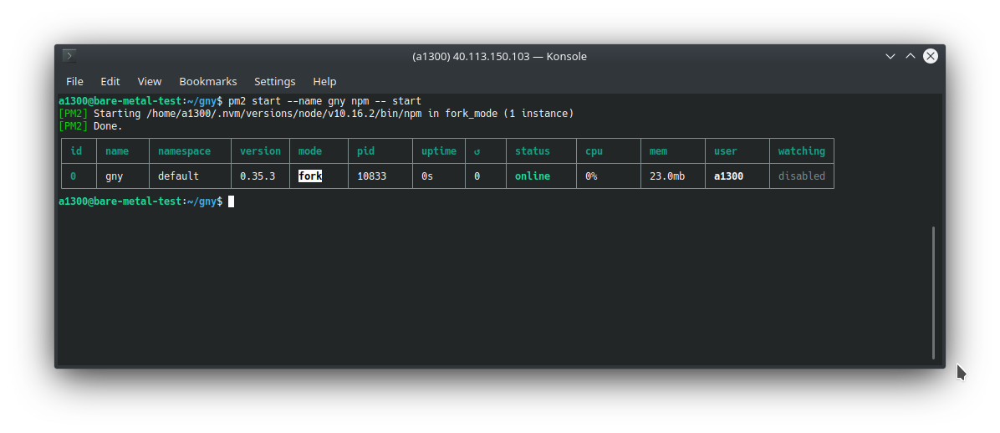
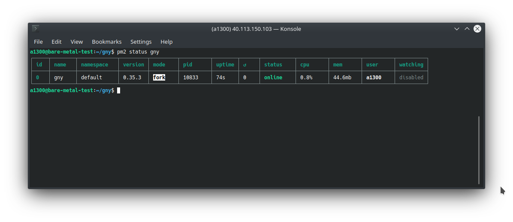

# Manage node

## With pm2

### Install pm2

Install `pm2`:

```bash
npm install pm2 --global
```

### Start gny

```bash
# first go to the gny directory
cd gny

# start gny
pm2 start --name gny npm -- start
```



### Show logs

```bash
pm2 logs gny
```

### Stop gny

```bash
pm2 stop gny
```

### Status of gny

```bash
pm2 status gny
```



### Delete gny

```bash
pm2 delete gny
```
