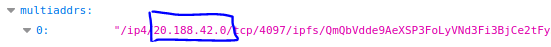
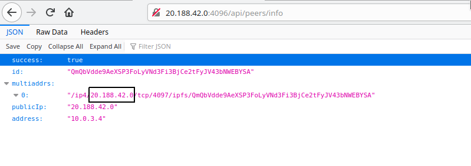

# Configure

## Start Forging

In order to start forging please pass a secret or multiple secrets (comma separated) to the GNY Blockchain.

> Information  
> In order start forging you need to first register as delegate. Be sure checkout our [Guides](../guide/).

Change CLI arguments:

```diff
- npm run start
+ npm run start -- --secret="chief next globe deny try danger trust wet spoil away eight task"
```

Change your `docker-compose.yml`:

```diff
services:
  # db1 service omitted
  node1:
    build: .
    container_name: "node1"
    image: gny-experiment
    command: bash -c 'while !</dev/tcp/db1/5432; do sleep 1; done; node packages/main/dist/src/app --ormConfig "ormconfig.integration.json"'
    environment:
+	  - GNY_SECRET=chief next globe deny try danger trust wet spoil away eight task
      - NODE_ENV="production"
    ports:
      - "4096:4096"
      - "4097:4097"
    depends_on:
      - db1
```

## Configure Public IP

::: warning
The **publicIp** option is mandatory on the `testnet` and on the `mainnet`. If you don't set it then the node will automatically use its privateIp which which will make the p2p communication with other nodes not work.
::::

The GNY Blockchain uses [libp2p](https://github.com/libp2p/js-libp2p/) for p2p communication. Libp2p itself communicates with the help of [multiaddr](https://www.npmjs.com/package/multiaddr). The standard procedure is to add a multiaddrs that listens on `0.0.0.0` and the libp2p automatically binds to privateIP address. As pointed out above this will not work on the `testnet` and on the `mainnet`

```js
const multi = `/ip4/0.0.0.0/tcp/4097`;
peerInfo.multiaddrs.add(multi);
```

This results in a own multiaddr array of e.g. where `10.0.3.4` is private IP address

```js
{
  multiaddr: [
    "/ip4/10.0.3.4/tcp/4097/ipfs/QmQbVdde9AeXSP3FoLyVNd3Fi3BjCe2tFyJV43bNWEBYSA"
  ];
}
```

The problem shows itself in the communication with other nodes. Because our node announces a private address which another node can't communicate with. Therefore we have to pass the **publicIP** to the GNY node.

The `publicIP` can be passed to the GNY node:

- as argument: `--publicIP=20.188.42.0`
- as environment variable: `GNY_PUBLIC_IP=20.188.42.0`

Pass `publicIp` as argument:

```diff
- npm run start
+ npm run start -- --publicIP="20.188.42.0"
```

Pass `publicIp` as environment variable:

```diff
services:
  # db1 service omitted
  node1:
    build: .
    container_name: "node1"
    image: gny-experiment
    command: bash -c 'while !</dev/tcp/db1/5432; do sleep 1; done; node packages/main/dist/src/app --ormConfig "ormconfig.integration.json"'
    environment:
+	  - GNY_PUBLIC_IP=20.188.42.0
      - NODE_ENV="production"
    ports:
      - "4096:4096"
      - "4097:4097"
    depends_on:
      - db1
```

::: tip
After that the own `publicIP` configuration needs to be checked with the HTTP API endpint `/api/peers/info` which display information about the own node!
:::

It is important that the `multiaddrs` array displays only one entry with the correct **publicIp**





<br>

## All Environment Variable Options

## All available Options

```
Options:
  -V, --version              output the version number
  -c, --config <path>        Config file path
  -p, --port <port>          Listening port number
  -a, --address <ip>         Listening host name or ip
  -g, --genesisblock <path>  Genesisblock path
  -x, --peers [peers...]     Peers list
  -l, --log <level>          Log level
  -d, --daemon               Run gny node as daemon
  --base <dir>               Base directory
  --ormConfig <file>         ormconfig.json file
  --privateP2PKey <key>      Private P2P Key (base64 encoded) - overrides p2p_key.json file
  --secret [secret...]       comma separated secrets
  --publicIP <ip>            Public IP of own server
  --noLogFile                no log output to file
  -h, --help                 output usage information
```
