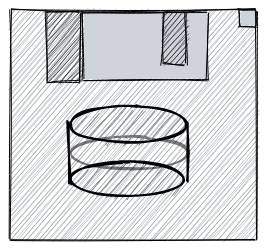
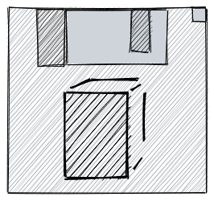
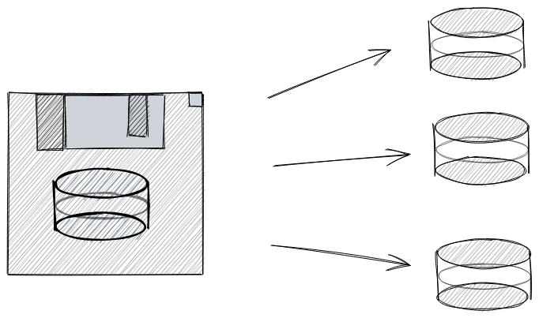
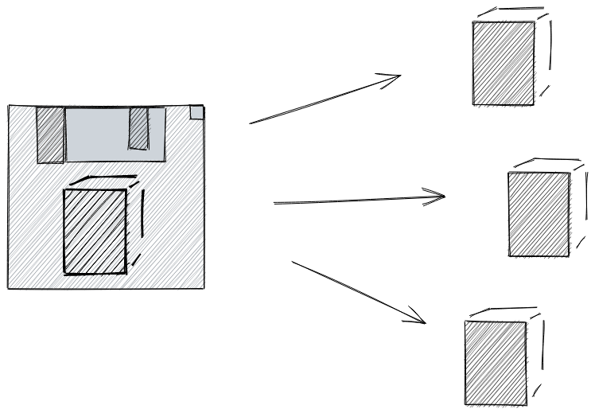
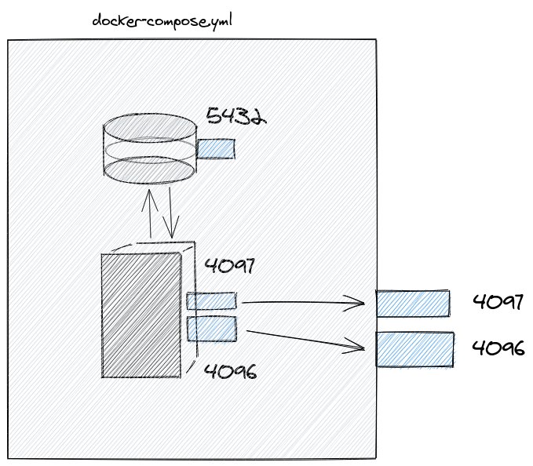
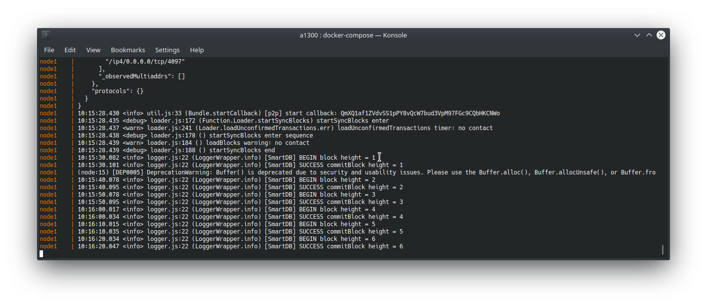
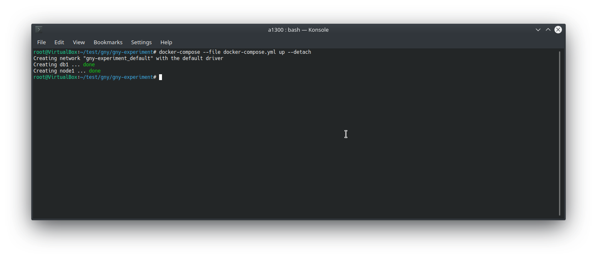
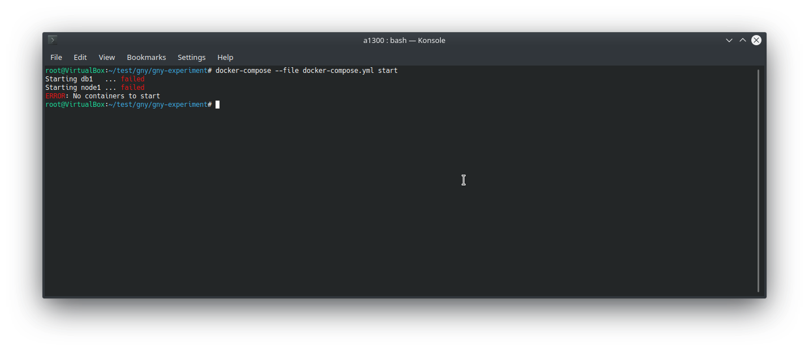
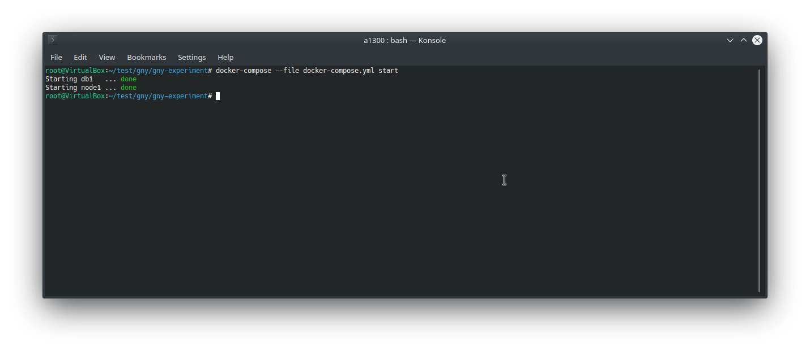
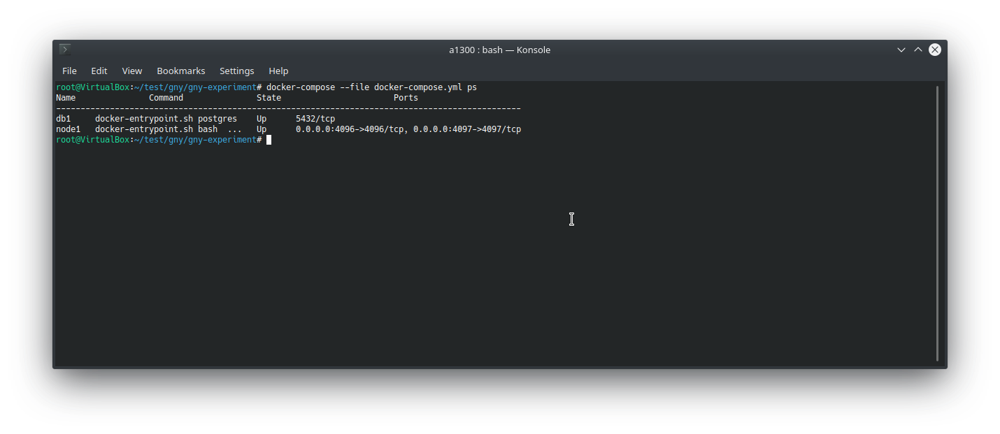

# Manage node

## With Docker

This is only a short excerpt from the fantastic [docs.docker.com](https://docs.docker.com/) documentation website. Please visit it for more indepth information.

# Visualization

`docker-compose` consists of many services that are started together and interact together. In our case we have the services: GNY Blockchain Node (a `node.js` app) and a database (`postgres`) service.

 

This two services are based off the [docker images](https://docs.docker.com/engine/reference/commandline/images/) `postgres:9.6.12` and `gny/blockchain`.

### Docker Images

A `docker image` is like a cookie cutter which can cuts cookies (instantiate containers). From one image we can create exact the same program, without the need to install or provide all libraries a program depends upon.

 

From an image we can create multiple containers.

|                                                                                                   |                                                                                                       |
| :-----------------------------------------------------------------------------------------------: | :---------------------------------------------------------------------------------------------------: |
|  |  |

### Docker networks

`docker-compose` creates a network where only the services inside the `docker-compose` file can communicate. This is represented by the grey box. We can configure which service ports from the containers are visible on the host machine. The `postgres` database port is not reachable from the host machine. Only the GNY Blockchain can access the `postgres` database. The GNY Blockchain ports are mapped to the

This is the beauty of `docker-compose`. We can specify the `docker images` that should work together and with one command we can all embedded services.



# Docker-Compose 101

## Create and Start all services

```bash
docker-compose --file docker-compose.yml up
```

This command does will print all container messages to screen:


## Create and Start all services

```bash
docker-compose --file docker-compose.yml up --detach
```

This command runs all services in background. See `logs` command to see the logs of the services in the background.



## Start all services

This can only be executed if the docker-compose `network` and all `containers` were created previously. For example after an `docker-compose stop`.

```bash
docker-compose --file docker-compose.yml start
```





## Check status of services

```bash
docker-compose --file docker-compose.yml ps
```



## Stop all services

```bash
docker-compose --file docker-compose.yml stop
```


## Stop and Remove

This removes the docker-compose `network` and `volumes` that were created.

```bash
docker-compose --file docker-compose.yml down --volumes
```

<br>

## Docker 101

## Images

### Show all images

```bash
sudo docker image ls
```

### Get bash into image

```bash
sudo docker run -it <imageId> /bin/bash
```

## Containers

### Show status of running containers

```bash
sudo docker ps --all
```

### Show status of containers of a docker-compose file

```bash
sudo docker-compose --file docker-compose.yml ps
```

### Bash into running container

```bash
sudo docker exec -it <containerId> /bin/bash
```

## Delete

### Stop all running containers

```bash
sudo docker stop $(sudo docker ps --all --quiet)
```

### Delete all stopped containers

```bash
sudo docker rm $(sudo docker ps --all --quiet)
```

<br/>
