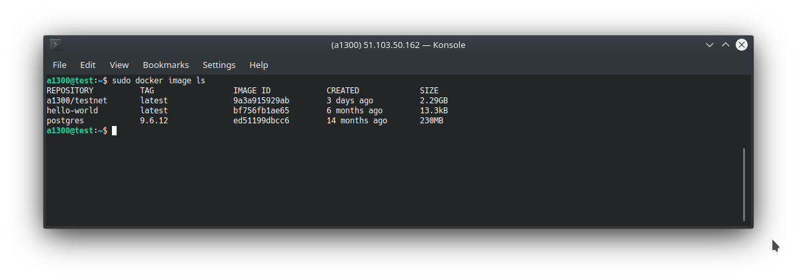
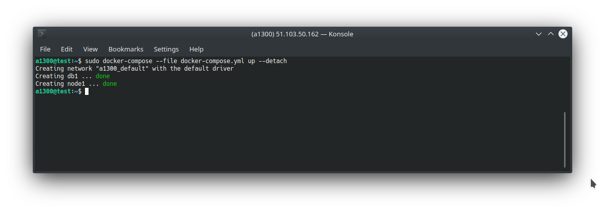
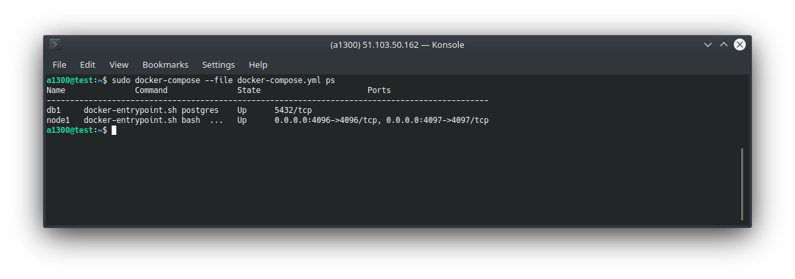

# Upgrade Docker

## Check if both of your services (`db1` and `node1` are running)

```bash
sudo docker-compose --file docker-compose.yml ps
```

## Pull newest docker image

:::: tabs

::: tab mainnet

Pull the latest `mainnet` image:

```bash
sudo docker pull gnyio/node:mainnet
```

:::

::: tab testnet

Pull the latest `testnet` image:

```bash
sudo docker pull gnyio/node:testnet
```

:::

::: tab mainnet-arm

Pull the latest `mainnet-arm` image:

```bash
sudo docker pull gnyio/node:mainnet-arm
```

:::

::: tab testnet-arm

Pull the latest `testnet-arm` image:

```bash
sudo docker pull gnyio/node:testnet-arm
```

:::

::::

## Check your local docker images

```bash
sudo docker image ls
```



## Make the upgrade

We keep the database sersvice `db1` running and

- stop
- delete
- and recreate service `node1`

```bash
# stop node1
sudo docker stop node1
# remove node1
sudo docker rm node1

# start node1 with the latest image
sudo docker-compose --file docker-compose.yml up --detach
```



## Check again

```bash
sudo docker-compose --file docker-compose.yml ps
```



## Restore from snapshots

:::: tabs

::: tab mainnet
Get the latest `mainnet` snapshot file name from [the snapshots site](https://mainnet.snapshots.gny.io/), and run the following bash script by replacing the snapshot name:

```bash
# If you run your node with docker, please follow the statements below.

#You need ~ 10GB of free space for this
sudo apt-get install zip unzip

# download
wget http://mainnet.snapshots.gny.io/v2_height_xxxxxxx_xx-xx-2021_xx_xx_xx.zip
unzip v2_height_xxxxxxx_xx-xx-2021_xx_xx_xx.zip


sudo docker-compose --file docker-compose.yml down


# make space
sudo docker volume prune --force


# get newest image
sudo docker-compose --file docker-compose.yml pull


# restore
sudo docker-compose --file docker-compose.yml up --no-start
sudo docker-compose --file docker-compose.yml start db1


sleep 10s
cat v2_height_xxxxxxx_xx-xx-2021_xx_xx_xx.sql | sudo docker exec -i db1 psql -U postgres


# start again
sudo docker-compose --file docker-compose.yml up --detach
```

:::

::: tab testnet

Get the latest `testnet` snapshot file name from [the snapshots site](https://testnet.snapshots.gny.io/), and run the following bash script by replacing the snapshot name:

```bash
# If you run your node with docker, please follow the statements below.

#You need ~ 10GB of free space for this
sudo apt-get install zip unzip

# download
wget http://testnet.snapshots.gny.io/v2_height_xxxxxxx_xx-xx-2021_xx_xx_xx.zip
unzip v2_height_xxxxxxx_xx-xx-2021_xx_xx_xx.zip


sudo docker-compose --file docker-compose.yml down


# make space
sudo docker volume prune --force


# get newest image
sudo docker-compose --file docker-compose.yml pull


# restore
sudo docker-compose --file docker-compose.yml up --no-start
sudo docker-compose --file docker-compose.yml start db1


sleep 10s
cat v2_height_xxxxxxx_xx-xx-2021_xx_xx_xx.sql | sudo docker exec -i db1 psql -U postgres


# start again
sudo docker-compose --file docker-compose.yml up --detach
```

:::

::::
